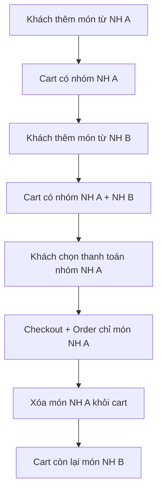

# Cart — API Specification (Multi-Restaurant)

Tài liệu mô tả **các thay đổi Backend cần thực hiện** để hỗ trợ giỏ hàng đa nhà hàng (kiểu Shopee):

- **1 cart** có thể chứa món từ **nhiều nhà hàng khác nhau**.
- Khi **thanh toán**, khách chỉ được chọn và đặt hàng **món thuộc 1 nhà hàng** trong lần checkout đó.
- Sau khi đặt hàng thành công, **chỉ xóa món của nhà hàng vừa order**; giữ lại món của các nhà hàng khác.

> **Phạm vi:** Backend (`/api/cart`, `/api/orders`, `/api/home/counters`, `/api/orders/:id/reorder`)  
> **Đối tượng đọc:** Team BE implement + Team FE integrate  
> **Base URL:** `/api`  
> **Auth:** `Authorization: Bearer <access_token>` (role `CUSTOMER`)  
> **Response wrapper:** `{ "success": true, "data": { ... } }`

---

## 1. Tổng quan yêu cầu nghiệp vụ

### 1.1. Hành vi mong muốn (giống Shopee)



### 1.2. Hành vi hiện tại (cần sửa)

| Hành vi | Hiện tại (BE) | Mong muốn |
|---------|---------------|-----------|
| Thêm món nhà hàng khác | Có thể reject / replace cart / chỉ cho 1 NH | Cho phép cùng tồn tại |
| `GET /cart` response | Có field `restaurant` ở cấp cart (1 NH) | Bỏ hoặc deprecated; thêm `restaurantGroups` |
| Sau `POST /orders` | `clearCartAfterOrder: true` → xóa toàn bộ cart | Mặc định chỉ xóa món của `restaurantId` vừa order |
| `POST /orders/:id/reorder` | Có thể conflict nếu cart đang có NH khác | Merge vào cart, không xóa NH khác |
| Badge cart (`cartItemCount`) | Đếm tổng item | Vẫn đếm tổng item (không đổi) |

### 1.3. Nguyên tắc thiết kế

1. **Cart thuộc về user**, không thuộc về 1 restaurant.
2. **Mỗi cart item** luôn gắn với đúng 1 `restaurantId` (qua `food.restaurantId`).
3. **Order** luôn thuộc đúng 1 `restaurantId` — không đổi.
4. **Validation checkout:** mọi `orderFoods` phải cùng `restaurantId` với `restaurantId` trong body order.
5. **Backward compatible:** FE cũ gửi `clearCartAfterOrder: true` vẫn hoạt động (xóa toàn bộ); FE mới dùng `false` hoặc bỏ field (mặc định mới).

---

## 2. Thay đổi Data Model (Database)

### 2.1. Bảng `Cart` (header)

**Hiện tại (giả định):** cart có thể có `restaurantId` FK → ràng buộc 1 cart = 1 NH.

**Cần sửa:**

```sql
-- Bỏ ràng buộc 1 cart = 1 restaurant (nếu đang có)
ALTER TABLE "Cart" DROP CONSTRAINT IF EXISTS "Cart_restaurantId_fkey";
ALTER TABLE "Cart" DROP COLUMN IF EXISTS "restaurantId";

-- Cart chỉ còn gắn với user
-- Cart: { id, userId, createdAt, updatedAt }
-- UNIQUE(userId) — mỗi user 1 cart active
```

| Field | Type | Mô tả |
|-------|------|--------|
| `id` | int PK | |
| `userId` | int FK, UNIQUE | Mỗi customer 1 cart |
| `createdAt` | datetime | |
| `updatedAt` | datetime | |

### 2.2. Bảng `CartItem`

**Giữ nguyên / đảm bảo có:**

| Field | Type | Mô tả |
|-------|------|--------|
| `id` | int PK | `cartItemId` trả về FE |
| `cartId` | int FK | |
| `foodId` | int FK | |
| `foodSizeId` | int? FK | Nullable nếu món không có size |
| `quantity` | int | `>= 1` |
| `fullText` | string? | Ghi chú món (note) |

**Unique constraint (quan trọng):**

```sql
UNIQUE (cartId, foodId, foodSizeId)
-- foodSizeId NULL được coi là 1 giá trị riêng (PostgreSQL: dùng partial unique hoặc COALESCE)
```

> `restaurantId` **không cần lưu riêng** trên `CartItem` — lấy qua join `Food.restaurantId`.  
> Nếu đã có cột `restaurantId` denormalized thì giữ để query nhanh, nhưng phải sync từ `Food` khi insert.

### 2.3. Index đề xuất

```sql
CREATE INDEX idx_cart_item_cart_id ON "CartItem"(cartId);
CREATE INDEX idx_food_restaurant_id ON "Food"(restaurantId);
```

---

## 3. Response Schema mới — `CartResponse`

### 3.1. Cấu trúc đề xuất (breaking change có kiểm soát)

```json
{
  "success": true,
  "data": {
    "id": 1,
    "totalItems": 5,
    "subtotal": 250000,
    "restaurantGroups": [
      {
        "restaurant": {
          "id": 10,
          "name": "Phở Hà Nội",
          "image": "https://...",
          "deliveryFee": 15000,
          "estimatedDeliveryTime": 30
        },
        "itemCount": 3,
        "subtotal": 180000,
        "items": [
          {
            "id": 101,
            "quantity": 2,
            "lineTotal": 120000,
            "foodSizeId": 5,
            "sizeName": "Lớn",
            "fullText": "Ít hành",
            "food": {
              "id": 1,
              "name": "Phở bò",
              "price": 60000,
              "image": "https://...",
              "label": "Bán chạy",
              "restaurantId": 10,
              "restaurant": {
                "id": 10,
                "name": "Phở Hà Nội"
              },
              "category": {
                "id": 2,
                "name": "Món chính"
              }
            }
          }
        ]
      },
      {
        "restaurant": {
          "id": 20,
          "name": "Burger King",
          "image": "https://...",
          "deliveryFee": 20000,
          "estimatedDeliveryTime": 25
        },
        "itemCount": 2,
        "subtotal": 70000,
        "items": [ "..."]
      }
    ],
    "items": [ "... flat list — giữ để backward compatible FE cũ ..." ]
  }
}
```

### 3.2. Field mapping

| Field | Type | Bắt buộc | Mô tả |
|-------|------|----------|--------|
| `id` | int | ✅ | Cart ID |
| `totalItems` | int | ✅ | Tổng số lượng (sum quantity) |
| `subtotal` | double | ✅ | Tổng tiền tất cả nhóm |
| `restaurantGroups` | array | ✅ | **Mới** — nhóm theo restaurant |
| `restaurant` (cấp cart) | object? | ❌ | **Deprecated** — giữ `null` hoặc bỏ hẳn sau 1 version |
| `items` | array | ✅ | Flat list tất cả items (giữ tương thích FE hiện tại) |

### 3.3. `RestaurantGroupResponse`

| Field | Type | Mô tả |
|-------|------|--------|
| `restaurant` | `CartRestaurantResponse` | Thông tin NH |
| `itemCount` | int | Sum quantity trong nhóm |
| `subtotal` | double | Sum lineTotal trong nhóm |
| `items` | `CartItemResponse[]` | Items thuộc NH này |

### 3.4. `CartRestaurantResponse` (mở rộng)

| Field | Type | Bắt buộc | Mô tả |
|-------|------|----------|--------|
| `id` | int | ✅ | |
| `name` | string | ✅ | |
| `image` | string? | ❌ | Dùng cho UI group header |
| `deliveryFee` | double? | ❌ | FE hiển thị ước tính phí ship theo NH |
| `estimatedDeliveryTime` | int? | ❌ | Phút |

### 3.5. Quy tắc sort

- `restaurantGroups`: sort theo `updatedAt` mới nhất của item trong nhóm (DESC) — NH vừa thêm món lên đầu.
- `items` trong mỗi nhóm: sort theo `CartItem.updatedAt` DESC.

---

## 4. API Reference — Chi tiết từng endpoint

---

### 4.1. `GET /api/cart`

Lấy toàn bộ giỏ hàng của user đang đăng nhập.

| | |
|---|---|
| **Method** | `GET` |
| **Auth** | Bearer, role `CUSTOMER` |
| **Thay đổi** | Response thêm `restaurantGroups`; bỏ `restaurant` ở cấp cart |

#### Response 200

Xem mục [3. Response Schema mới](#3-response-schema-mới--cartresponse).

#### Response khi cart rỗng

```json
{
  "success": true,
  "data": {
    "id": 1,
    "totalItems": 0,
    "subtotal": 0,
    "restaurantGroups": [],
    "items": []
  }
}
```

#### Logic BE

```typescript
// Pseudocode
async getCart(userId: number): Promise<CartResponse> {
  const cart = await findOrCreateCart(userId);
  const items = await findCartItemsWithFoodAndRestaurant(cart.id);

  const groups = groupBy(items, item => item.food.restaurantId)
    .map(group => ({
      restaurant: mapRestaurant(group[0].food.restaurant),
      itemCount: sum(group, 'quantity'),
      subtotal: sum(group, 'lineTotal'),
      items: group,
    }))
    .sortByMostRecentlyUpdated();

  return {
    id: cart.id,
    totalItems: sum(items, 'quantity'),
    subtotal: sum(items, 'lineTotal'),
    restaurantGroups: groups,
    items, // flat
  };
}
```

---

### 4.2. `POST /api/cart`

Thêm món vào giỏ (hoặc tăng quantity nếu đã có cùng `foodId + foodSizeId`).

| | |
|---|---|
| **Method** | `POST` |
| **Auth** | Bearer, role `CUSTOMER` |
| **Thay đổi** | **Bỏ** logic reject/replace khi `food.restaurantId` khác restaurant hiện tại trong cart |

#### Request Body

```json
{
  "foodId": 1,
  "quantity": 2,
  "foodSizeId": 5,
  "fullText": "Ít hành, thêm tiêu"
}
```

| Field | Type | Bắt buộc | Validation |
|-------|------|----------|------------|
| `foodId` | int | ✅ | Food tồn tại, `isActive = true` |
| `quantity` | int | ✅ | `>= 1`, max 99 (configurable) |
| `foodSizeId` | int? | ❌ | Bắt buộc nếu food có sizes; phải thuộc food đó |
| `fullText` | string? | ❌ | Max 500 ký tự |

#### Response 200

Trả về **full `CartResponse`** sau khi thêm (giống `GET /cart`).

#### Business rules

1. **Không** kiểm tra / chặn restaurant khác với items hiện có.
2. Nếu đã có item cùng `(cartId, foodId, foodSizeId)` → **cộng dồn** `quantity`.
3. Validate `foodSizeId` thuộc đúng `foodId`.
4. Tính `lineTotal = unitPrice * quantity` (unitPrice lấy từ `FoodSize.price` hoặc `Food.price`).

#### Errors

| HTTP | Code / Message | Khi nào |
|------|----------------|---------|
| 400 | `Food not found` | `foodId` không tồn tại |
| 400 | `Food is not available` | Food inactive / hết hàng |
| 400 | `Invalid food size` | `foodSizeId` không thuộc food |
| 400 | `Quantity must be at least 1` | quantity < 1 |
| 401 | Unauthorized | Không có token |

#### Hành vi CŨ cần GỠ BỎ

```typescript
// ❌ KHÔNG làm nữa
if (cart.restaurantId && cart.restaurantId !== food.restaurantId) {
  throw new BadRequestException('Cart already contains items from another restaurant');
  // hoặc auto clearCart() rồi add — cũng không làm
}
```

---

### 4.3. `PATCH /api/cart/:cartItemId`

Cập nhật số lượng 1 cart item.

| | |
|---|---|
| **Method** | `PATCH` |
| **Auth** | Bearer, role `CUSTOMER` |
| **Thay đổi** | Không đổi contract; đảm bảo response trả `restaurantGroups` |

#### Request Body

```json
{
  "quantity": 3
}
```

| Field | Type | Bắt buộc | Validation |
|-------|------|----------|------------|
| `quantity` | int | ✅ | `>= 1` |

> Nếu `quantity = 0` → BE có thể reject 400 hoặc auto-delete item. **Khuyến nghị:** reject 400, bắt FE dùng `DELETE`.

#### Response 200

Full `CartResponse`.

#### Errors

| HTTP | Message | Khi nào |
|------|---------|---------|
| 404 | `Cart item not found` | `cartItemId` không thuộc cart của user |
| 403 | `Forbidden` | Item thuộc cart user khác |

---

### 4.4. `DELETE /api/cart/:cartItemId`

Xóa 1 cart item.

| | |
|---|---|
| **Method** | `DELETE` |
| **Auth** | Bearer, role `CUSTOMER` |
| **Thay đổi** | Response trả `CartResponse` (không phải `Unit`) — **giữ như FE đang expect** |

#### Response 200

Full `CartResponse` sau khi xóa.

---

### 4.5. `DELETE /api/cart` — Xóa toàn bộ giỏ

| | |
|---|---|
| **Method** | `DELETE` |
| **Auth** | Bearer, role `CUSTOMER` |
| **Thay đổi** | Không đổi |

#### Response 200

```json
{
  "success": true,
  "data": null
}
```

---

### 4.6. `DELETE /api/cart/restaurant/:restaurantId` — **[API MỚI]**

Xóa **tất cả cart items** thuộc 1 nhà hàng. Dùng khi:
- User bấm "Xóa nhóm" trên UI cart.
- Sau order thành công (FE gọi thay vì clear toàn bộ).
- BE gọi nội bộ khi `POST /orders` với `clearCartAfterOrder: false` (mặc định mới).

| | |
|---|---|
| **Method** | `DELETE` |
| **Auth** | Bearer, role `CUSTOMER` |
| **Path param** | `restaurantId` — int |

#### Response 200

Full `CartResponse` sau khi xóa nhóm.

#### Response khi NH không có trong cart

Vẫn 200, trả cart hiện tại (không lỗi).

#### Logic BE

```typescript
async clearCartByRestaurant(userId: number, restaurantId: number) {
  const cart = await findCart(userId);
  await deleteCartItemsWhereFoodRestaurantId(cart.id, restaurantId);
  return getCart(userId);
}
```

#### Errors

| HTTP | Message |
|------|---------|
| 404 | `Restaurant not found` — optional, có thể bỏ qua |

---

### 4.7. `GET /api/cart/restaurant/:restaurantId` — **[API MỚI — Optional]**

Lấy subset cart theo 1 nhà hàng. Hữu ích cho màn Checkout preview / tính phí ship theo NH.

| | |
|---|---|
| **Method** | `GET` |
| **Auth** | Bearer, role `CUSTOMER` |

#### Response 200

```json
{
  "success": true,
  "data": {
    "restaurant": {
      "id": 10,
      "name": "Phở Hà Nội",
      "deliveryFee": 15000,
      "estimatedDeliveryTime": 30
    },
    "itemCount": 3,
    "subtotal": 180000,
    "items": [ "...CartItemResponse[]" ]
  }
}
```

> **Optional:** FE hiện tại có thể filter client-side từ `GET /cart`. API này giúp giảm payload nếu cart lớn.

---

### 4.8. `GET /api/cart/summary` — **[API MỚI — Optional]**

Preview bill cho 1 nhà hàng trước checkout (subtotal, delivery fee, voucher discount, total).

| | |
|---|---|
| **Method** | `GET` |
| **Auth** | Bearer, role `CUSTOMER` |
| **Query** | `restaurantId` (required), `voucherId` (optional) |

#### Response 200

```json
{
  "success": true,
  "data": {
    "restaurantId": 10,
    "subtotal": 180000,
    "deliveryFee": 15000,
    "discount": 20000,
    "total": 175000,
    "itemCount": 3,
    "voucher": {
      "id": 5,
      "code": "PHO20K",
      "isApplicable": true,
      "reason": null
    }
  }
}
```

---

## 5. Thay đổi Order API — `POST /api/orders`

Checkout vẫn **1 order = 1 restaurant**. Thay đổi chính nằm ở cách xóa cart sau order.

### 5.1. Request Body (giữ nguyên structure)

```json
{
  "restaurantId": 10,
  "voucherId": 5,
  "savedAddressId": 1,
  "orderFoods": [
    {
      "foodId": 1,
      "quantity": 2,
      "fullText": "Ít hành",
      "foodSizeId": 5
    }
  ],
  "note": "Gọi trước khi giao",
  "paymentMethod": "MOMO",
  "clearCartAfterOrder": false,
  "totalAmount": null
}
```

### 5.2. Thay đổi field `clearCartAfterOrder`

| Giá trị | Hành vi CŨ | Hành vi MỚI |
|---------|------------|-------------|
| `true` | Xóa toàn bộ cart | Xóa toàn bộ cart (giữ backward compatible) |
| `false` | *(chưa rõ / có thể vẫn xóa hết)* | **Chỉ xóa cart items có `food.restaurantId = restaurantId`** |
| không gửi | Mặc định `true` | **Mặc định đổi thành `false`** (breaking — xem migration) |

**Khuyến nghị migration an toàn:**

```typescript
// Phase 1: default false cho app version mới (FE gửi explicit)
// Phase 2: đổi default BE sau khi FE deploy xong

const clearAll = dto.clearCartAfterOrder === true;
if (clearAll) {
  await clearEntireCart(userId);
} else {
  await clearCartByRestaurant(userId, dto.restaurantId);
}
```

### 5.3. Validation mới (bắt buộc)

```typescript
// 1. Mọi orderFoods phải thuộc đúng restaurantId
for (const item of orderFoods) {
  const food = await findFood(item.foodId);
  if (food.restaurantId !== dto.restaurantId) {
    throw new BadRequestException(
      `Food ${item.foodId} does not belong to restaurant ${dto.restaurantId}`
    );
  }
}

// 2. Mọi orderFood phải tồn tại trong cart của user (khuyến nghị strict mode)
const cartItems = await getCartItemsByRestaurant(userId, dto.restaurantId);
for (const orderFood of orderFoods) {
  const match = cartItems.find(
    ci => ci.foodId === orderFood.foodId
      && ci.foodSizeId === (orderFood.foodSizeId ?? null)
      && ci.quantity >= orderFood.quantity
  );
  if (!match) {
    throw new BadRequestException('Cart item mismatch or insufficient quantity');
  }
}

// 3. Voucher phải applicable cho restaurantId + subtotal
```

### 5.4. Errors bổ sung

| HTTP | Message | Khi nào |
|------|---------|---------|
| 400 | `All foods must belong to the same restaurant` | `orderFoods` lẫn NH |
| 400 | `No items from this restaurant in cart` | Cart không có món NH này |
| 400 | `Cart item mismatch` | `orderFoods` không khớp cart |
| 400 | `Restaurant is closed` | NH đóng cửa |

### 5.5. Response

**Không đổi** — vẫn trả `order`, `paymentInformation`, `conversation`, ...

### 5.6. Side effect sau order thành công

```
1. Tạo Order + OrderFoods + Payment
2. Nếu clearCartAfterOrder === true  → DELETE all cart items
3. Nếu clearCartAfterOrder === false → DELETE cart items WHERE food.restaurantId = restaurantId
4. Gửi notification cho owner NH
```

---

## 6. Thay đổi `POST /api/orders/:orderId/reorder`

Đặt lại món từ đơn cũ vào cart.

### 6.1. Hành vi mới

1. Lấy items từ order cũ.
2. **Merge** vào cart hiện tại (không xóa items NH khác).
3. Với mỗi món: gọi logic giống `POST /cart` (cộng dồn nếu trùng).
4. Nếu food đã inactive → skip item đó, trả warning trong response.

### 6.2. Response đề xuất

```json
{
  "success": true,
  "data": {
    "cart": { "...CartResponse với restaurantGroups..." },
    "addedCount": 3,
    "skippedItems": [
      {
        "foodId": 99,
        "reason": "Food is no longer available"
      }
    ]
  }
}
```

### 6.3. Hành vi CŨ cần GỠ BỎ

```typescript
// ❌ KHÔNG làm nữa
await clearCart(userId);
await addReorderItems(...);
```

---

## 7. Thay đổi `GET /api/home/counters`

### 7.1. Hiện tại

```json
{
  "success": true,
  "data": {
    "cartItemCount": 5,
    "unreadMessageCount": 2
  }
}
```

### 7.2. Thay đổi

| Field | Hành vi |
|-------|---------|
| `cartItemCount` | **Giữ nguyên** — tổng `sum(quantity)` của tất cả cart items (mọi NH) |

### 7.3. Field mới (optional)

```json
{
  "cartItemCount": 5,
  "cartRestaurantCount": 2,
  "unreadMessageCount": 2
}
```

| Field | Mô tả |
|-------|--------|
| `cartRestaurantCount` | Số nhà hàng khác nhau trong cart — dùng badge UI nếu cần |

---

## 8. Voucher APIs — Ràng buộc liên quan Cart

Các API voucher hiện có **đã đúng hướng** (filter theo `restaurantId`):

- `GET /api/vouchers/suitable/:restaurantId?cost=...`
- `GET /api/vouchers?restaurantId=...`
- `GET /api/vouchers/code/:code?restaurantId=...`

**Không cần đổi contract**, chỉ đảm bảo:
- `cost` = subtotal của **nhóm NH đang checkout**, không phải tổng cart.
- Voucher system-wide (`restaurantId = null`) vẫn apply được nếu đủ điều kiện.

---

## 9. Ma trận Test Cases (BE)

### 9.1. Cart CRUD

| # | Scenario | Expected |
|---|----------|----------|
| 1 | Cart rỗng, add món NH A | `restaurantGroups.length = 1` |
| 2 | Cart có NH A, add món NH B | `restaurantGroups.length = 2`, không mất NH A |
| 3 | Add trùng food+size NH A | Quantity cộng dồn |
| 4 | Delete 1 item NH A | NH B không bị ảnh hưởng |
| 5 | `DELETE /cart/restaurant/:id` | Chỉ xóa NH đó |
| 6 | `DELETE /cart` | Xóa hết |

### 9.2. Order + Cart cleanup

| # | Scenario | Expected |
|---|----------|----------|
| 7 | Order NH A, `clearCartAfterOrder: false` | Chỉ món NH A bị xóa |
| 8 | Order NH A, `clearCartAfterOrder: true` | Toàn bộ cart xóa |
| 9 | Order với food không thuộc `restaurantId` | 400 |
| 10 | Order khi cart không có món NH đó | 400 |
| 11 | Order thành công, cart còn NH B → Order tiếp NH B | OK |

### 9.3. Reorder

| # | Scenario | Expected |
|---|----------|----------|
| 12 | Reorder khi cart có NH khác | Merge, không xóa NH khác |
| 13 | Reorder có món inactive | Skip + warning |

---

## 10. Migration & Rollout

### 10.1. Database migration

1. Drop `Cart.restaurantId` (nếu có).
2. Đảm bảo unique `(cartId, foodId, foodSizeId)`.
3. Backfill: không cần — data hiện tại đã có items với food FK.

### 10.2. API versioning (khuyến nghị)

| Phase | BE | FE |
|-------|----|----|
| **Phase 1** | Thêm `restaurantGroups`, giữ `items` flat, `restaurant` = null | Update Cart UI group by NH |
| **Phase 2** | Thêm `DELETE /cart/restaurant/:id` | Gọi sau order + nút xóa nhóm |
| **Phase 3** | Đổi default `clearCartAfterOrder` → `false` | Gửi `clearCartAfterOrder: false` explicit |
| **Phase 4** | Remove deprecated `restaurant` ở cấp cart | Cleanup DTO |

### 10.3. Backward compatibility

| Client | Behavior |
|--------|----------|
| FE cũ (single restaurant) | Vẫn đọc `items` flat; `restaurantGroups[0]` hoặc `items` đều work |
| FE mới | Dùng `restaurantGroups` + `clearCartAfterOrder: false` |

---

## 11. Mapping FE (tham khảo integration)

| FE file / logic | API sử dụng |
|-----------------|-------------|
| `CartRepositoryImpl.syncCart()` | `GET /cart` |
| `CartRepositoryImpl.addToCart()` | `POST /cart` |
| `CartViewModel.itemsByRestaurant` | Có thể dùng `restaurantGroups` từ BE thay vì group client |
| `CartViewModel.SelectRestaurant` | Chọn `restaurantId` (đổi từ `restaurantName`) |
| `CheckoutViewModel.placeOrder()` | `POST /orders` với `clearCartAfterOrder: false` |
| Sau order thành công | Không gọi `DELETE /cart`; BE tự xóa partial |
| Xóa nhóm NH trên UI | `DELETE /cart/restaurant/:restaurantId` |
| Badge TopBar | `GET /home/counters` → `cartItemCount` |

### 11.1. DTO FE cần cập nhật (khi BE deploy)

```kotlin
// CartDto.kt — thêm
@Serializable
data class CartResponse(
    val id: Int,
    val totalItems: Int,
    val subtotal: Double,
    val restaurantGroups: List<CartRestaurantGroupResponse> = emptyList(),
    val restaurant: CartRestaurantResponse? = null, // deprecated
    val items: List<CartItemResponse>
)

@Serializable
data class CartRestaurantGroupResponse(
    val restaurant: CartRestaurantResponse,
    val itemCount: Int,
    val subtotal: Double,
    val items: List<CartItemResponse>
)
```

```kotlin
// CartApi.kt — thêm
@DELETE("cart/restaurant/{restaurantId}")
suspend fun clearCartByRestaurant(
    @Path("restaurantId") restaurantId: Int
): Response<BaseResponse<CartResponse>>
```

---

## 12. Tóm tắt danh sách API cần sửa

| Endpoint | Loại thay đổi | Mức độ |
|----------|---------------|--------|
| `GET /cart` | Response + logic group | **Breaking (thêm field)** |
| `POST /cart` | Bỏ chặn multi-restaurant | **Logic change** |
| `PATCH /cart/:cartItemId` | Response thêm `restaurantGroups` | Minor |
| `DELETE /cart/:cartItemId` | Response thêm `restaurantGroups` | Minor |
| `DELETE /cart` | Không đổi | — |
| `DELETE /cart/restaurant/:restaurantId` | **API mới** | **New** |
| `GET /cart/restaurant/:restaurantId` | **API mới (optional)** | New |
| `GET /cart/summary` | **API mới (optional)** | New |
| `POST /orders` | Validation + partial cart clear | **Logic change** |
| `POST /orders/:id/reorder` | Merge thay vì replace cart | **Logic change** |
| `GET /home/counters` | Optional thêm `cartRestaurantCount` | Minor |

---

## 13. Checklist cho team BE

- [ ] Migration DB: bỏ `Cart.restaurantId`, unique constraint cart items
- [ ] Refactor `CartService.getCart()` → build `restaurantGroups`
- [ ] Refactor `CartService.addToCart()` → bỏ single-restaurant guard
- [ ] Implement `clearCartByRestaurant(userId, restaurantId)`
- [ ] Expose `DELETE /cart/restaurant/:restaurantId`
- [ ] Update `OrderService.create()` → partial cart cleanup
- [ ] Đổi default `clearCartAfterOrder` (theo phase rollout)
- [ ] Validate `orderFoods` cùng `restaurantId`
- [ ] Update `reorder` → merge cart
- [ ] Update Swagger `/api/docs`
- [ ] Viết integration tests theo mục [9](#9-ma-trận-test-cases-be)
