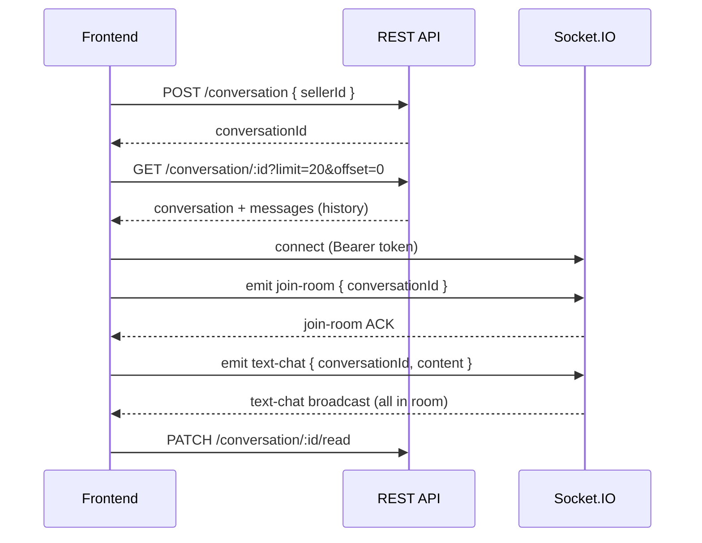

# Chat API Docs (for FE)

Tài liệu mô tả đầy đủ REST API + Socket.IO realtime cho module Chat/Conversation.

> **Nguồn code:** `src/modules/conversation/*`, `src/realtime/*`, `prisma/models/chat.prisma`

---

## 1) Base Info

| Mục | Giá trị |
|-----|---------|
| REST Base URL | `http://<host>:4000/api` |
| Socket.IO URL | `http://<host>:4000` (cùng host/port, **không** có prefix `/api`) |
| Swagger | `GET /api/docs` |
| Auth header (REST) | `Authorization: Bearer <access_token>` |
| Auth (Socket) | Header `Authorization: Bearer <token>` **hoặc** `handshake.auth.token = "<token>"` |

### Khái niệm

- **Conversation**: phòng chat duy nhất giữa 1 `customerId` và 1 `sellerId` (unique theo cặp).
- **Room Socket**: `room-{conversationId}` (ví dụ `room-4`).
- **Customer**: role `CUSTOMER`, người mua.
- **Seller**: owner của restaurant, role thường là `BUSINESS`.

---

## 2) Response Contract (REST)

Backend bọc response qua `TransformInterceptor`:

### Success

```json
{
  "success": true,
  "data": { }
}
```

### Error

```json
{
  "success": false,
  "path": "/api/conversation/...",
  "notifi": "Cloudian Notification!!!",
  "statusCode": 404,
  "message": "Conversation not found"
}
```

`message` có thể là `string` hoặc `string[]` (validation error).

---

## 3) Shared Types (FE nên define)

```typescript
type Who = 'me' | 'other';

interface UserPreview {
  id: number;
  name: string;
  avatar: string | null;
}

interface RestaurantPreview {
  id: number;
  name: string;
  image: string | null;
}

interface Message {
  id: number;
  conversationId: number;
  senderId: number;
  content: string;
  image: string;       // "" nếu không có ảnh
  createdAt: string;   // ISO 8601
  isRead: boolean;
  who?: Who;           // chỉ có ở REST detail APIs
}

interface Conversation {
  id: number;
  customerId: number;
  sellerId: number;
  createdAt: string;
  updatedAt: string;
  customer: UserPreview;
  seller: UserPreview;
  restaurant?: RestaurantPreview | null;
}

interface ConversationListItem extends Conversation {
  lastMessage: {
    id: number;
    content: string;
    senderId: number;
    createdAt: string;
    image: string;
    isRead: boolean;
  } | null;
  unreadCount: number;
}
```

---

## 4) REST APIs

### 4.1. Lấy danh sách hội thoại của tôi

| | |
|---|---|
| **Method** | `GET` |
| **Path** | `/api/conversation/me` |
| **Auth** | Bearer (bắt buộc) |
| **Role** | Bất kỳ user đã login (CUSTOMER / BUSINESS / ADMIN) |

#### Request

- **Headers**
  ```
  Authorization: Bearer <access_token>
  ```
- **Query / Body**: không có

#### Response `200 OK`

```json
{
  "success": true,
  "data": [
    {
      "id": 4,
      "customerId": 3,
      "sellerId": 6,
      "updatedAt": "2026-06-26T10:00:00.000Z",
      "createdAt": "2026-06-20T08:00:00.000Z",
      "customer": {
        "id": 3,
        "name": "Nguyen Van A",
        "avatar": "https://..."
      },
      "seller": {
        "id": 6,
        "name": "Nha Hang ABC",
        "avatar": "https://..."
      },
      "restaurant": {
        "id": 12,
        "name": "Nha Hang ABC",
        "image": "https://..."
      },
      "lastMessage": {
        "id": 99,
        "content": "Xin chao",
        "senderId": 3,
        "createdAt": "2026-06-26T09:55:00.000Z",
        "image": "",
        "isRead": false
      },
      "unreadCount": 2
    }
  ]
}
```

#### Ghi chú FE

- `data` là **mảng rỗng** `[]` nếu chưa có hội thoại.
- Sắp xếp theo `updatedAt` giảm dần (mới nhất trước).
- `unreadCount`: số tin nhắn có `senderId != currentUserId` và `isRead == false`.
- `restaurant` lấy từ `sellerId` → `Restaurant.ownerId`; có thể `null` nếu seller chưa có restaurant.

#### Errors thường gặp

| statusCode | message |
|------------|---------|
| 401 | Unauthorized |

---

### 4.2. Tạo hoặc lấy hội thoại (customer ↔ seller)

| | |
|---|---|
| **Method** | `POST` |
| **Path** | `/api/conversation` |
| **Auth** | Bearer (bắt buộc) |
| **Role** | `CUSTOMER` only |

#### Request

- **Headers**
  ```
  Authorization: Bearer <access_token>
  Content-Type: application/json
  ```
- **Body**

```json
{
  "sellerId": 6
}
```

| Field | Type | Required | Mô tả |
|-------|------|----------|-------|
| `sellerId` | `number` (int, > 0) | ✅ | ID user owner của restaurant (seller) |

> **Lưu ý:** Body **không** có `orderId`. Mỗi cặp customer+seller chỉ có **1** conversation.

#### Response `200 OK` (hoặc `201` tùy Nest default)

Trả conversation đã tồn tại hoặc vừa tạo:

```json
{
  "success": true,
  "data": {
    "id": 4,
    "customerId": 3,
    "sellerId": 6,
    "createdAt": "2026-06-20T08:00:00.000Z",
    "updatedAt": "2026-06-20T08:00:00.000Z",
    "customer": {
      "id": 3,
      "name": "Nguyen Van A",
      "avatar": "https://..."
    },
    "seller": {
      "id": 6,
      "name": "Nha Hang ABC",
      "avatar": "https://..."
    }
  }
}
```

#### Errors

| statusCode | message | Nguyên nhân |
|------------|---------|-------------|
| 400 | `Customer and seller must be different users` | `sellerId` trùng user hiện tại |
| 400 | Validation failed | `sellerId` thiếu / không hợp lệ |
| 401 | Unauthorized | Token sai/hết hạn |
| 403 | Forbidden | User không phải CUSTOMER |
| 404 | `Seller restaurant not found` | `sellerId` không phải owner restaurant nào |

---

### 4.3. Chi tiết hội thoại theo Order ID

| | |
|---|---|
| **Method** | `GET` |
| **Path** | `/api/conversation/detail` |
| **Auth** | Bearer (bắt buộc) |
| **Role** | Customer của order **hoặc** seller (owner restaurant của order) |

#### Request

- **Headers**
  ```
  Authorization: Bearer <access_token>
  ```
- **Query**

| Param | Type | Required | Default | Mô tả |
|-------|------|----------|---------|-------|
| `orderId` | `number` | ✅ | — | Order dùng suy ra customer + seller |
| `limit` | `number` (≥ 1) | ❌ | `20` | Số tin nhắn mỗi trang |
| `offset` | `number` (≥ 0) | ❌ | `0` | Bỏ qua N tin (pagination) |

**Ví dụ:**
```
GET /api/conversation/detail?orderId=162432&limit=20&offset=0
```

#### Response `200 OK`

```json
{
  "success": true,
  "data": {
    "conversation": {
      "id": 4,
      "customerId": 3,
      "sellerId": 6,
      "createdAt": "2026-06-20T08:00:00.000Z",
      "updatedAt": "2026-06-26T10:00:00.000Z",
      "customer": {
        "id": 3,
        "name": "Nguyen Van A",
        "avatar": "https://..."
      },
      "seller": {
        "id": 6,
        "name": "Nha Hang ABC",
        "avatar": "https://..."
      },
      "restaurant": {
        "id": 12,
        "name": "Nha Hang ABC",
        "image": "https://..."
      }
    },
    "messages": [
      {
        "id": 100,
        "conversationId": 4,
        "senderId": 6,
        "content": "Da nhan don",
        "image": "",
        "createdAt": "2026-06-26T10:00:00.000Z",
        "isRead": true,
        "who": "other"
      },
      {
        "id": 99,
        "conversationId": 4,
        "senderId": 3,
        "content": "Xin chao",
        "image": "",
        "createdAt": "2026-06-26T09:55:00.000Z",
        "isRead": false,
        "who": "me"
      }
    ]
  }
}
```

#### Ghi chú FE

- `messages` sắp xếp **`createdAt` DESC** (tin mới nhất ở đầu mảng). UI chat thường cần **reverse** hoặc prepend khi load thêm.
- `who`: `"me"` nếu `senderId == currentUserId`, ngược lại `"other"`.
- **Không** có `pagination.total` — load more bằng cách tăng `offset`.
- Backend dùng `order.userId` + `order.restaurant.ownerId` để tìm conversation; conversation **không** lưu `orderId`.

#### Errors

| statusCode | message |
|------------|---------|
| 403 | `Only participants of the order conversation can view it` |
| 404 | `Order not found` |
| 404 | `Conversation not found` |

---

### 4.4. Chi tiết hội thoại theo Conversation ID

| | |
|---|---|
| **Method** | `GET` |
| **Path** | `/api/conversation/:conversationId` |
| **Auth** | Bearer (bắt buộc) |
| **Role** | User phải là `customerId` hoặc `sellerId` của conversation |

#### Request

- **Headers**
  ```
  Authorization: Bearer <access_token>
  ```
- **Path params**

| Param | Type | Mô tả |
|-------|------|-------|
| `conversationId` | `number` | ID hội thoại |

- **Query** (giống API 4.3)

| Param | Type | Default |
|-------|------|---------|
| `limit` | `number` | `20` |
| `offset` | `number` | `0` |

**Ví dụ:**
```
GET /api/conversation/4?limit=20&offset=20
```

#### Response `200 OK`

Cùng shape với API 4.3:

```json
{
  "success": true,
  "data": {
    "conversation": { "...": "..." },
    "messages": [ "..."]
  }
}
```

#### Errors

| statusCode | message |
|------------|---------|
| 404 | `Conversation not found` |

---

### 4.5. Upload ảnh chat

| | |
|---|---|
| **Method** | `POST` |
| **Path** | `/api/conversation/upload-image` |
| **Auth** | Bearer (bắt buộc) |
| **Content-Type** | `multipart/form-data` |

#### Request

- **Headers**
  ```
  Authorization: Bearer <access_token>
  ```
- **Body (form-data)**

| Field | Type | Required | Mô tả |
|-------|------|----------|-------|
| `file` | `File` (binary) | ✅ | Ảnh cần upload |

#### Response `200 OK`

```json
{
  "success": true,
  "data": {
    "imageUrl": "http://localhost:9000/<bucket>/1730000000000-photo.jpg"
  }
}
```

#### Errors

| statusCode | message |
|------------|---------|
| 400 | `No file provided` |

#### Ghi chú FE

1. Upload ảnh qua API này trước.
2. Lấy `data.imageUrl` gửi qua Socket event `text-chat` (field `image`).
3. `content` có thể để rỗng nếu chỉ gửi ảnh.

---

### 4.6. Đánh dấu đã đọc

| | |
|---|---|
| **Method** | `PATCH` |
| **Path** | `/api/conversation/:conversationId/read` |
| **Auth** | Bearer (bắt buộc) |

#### Request

- **Headers**
  ```
  Authorization: Bearer <access_token>
  ```
- **Path params**: `conversationId` (number)
- **Body**: không có

#### Response `200 OK`

Controller trả object có `success/message`, interceptor bọc thêm 1 lớp:

```json
{
  "success": true,
  "data": {
    "success": true,
    "message": "Marked all messages as read"
  }
}
```

#### Logic

- Đánh dấu `isRead = true` cho tất cả tin nhắn trong conversation mà:
  - `senderId != currentUserId`
  - `isRead == false`

#### Errors

| statusCode | message |
|------------|---------|
| 404 | `Conversation not found` |

---

### 4.7. [ADMIN] Lấy hội thoại theo userId

| | |
|---|---|
| **Method** | `GET` |
| **Path** | `/api/conversation/user/:userId` |
| **Auth** | Bearer |
| **Role** | `ADMIN` only |

#### Request

```
GET /api/conversation/user/3
Authorization: Bearer <admin_access_token>
```

#### Response

Giống API 4.1 (`ConversationListItem[]`).

---

## 5) Socket.IO Realtime

### 5.1. Kết nối

```typescript
import { io } from 'socket.io-client';

const socket = io('http://localhost:4000', {
  extraHeaders: {
    Authorization: `Bearer ${accessToken}`,
  },
  // hoặc:
  // auth: { token: accessToken },
});
```

| Cách auth | Ví dụ |
|-----------|-------|
| Header | `Authorization: Bearer <token>` |
| Auth object | `auth: { token: "<token>" }` hoặc `Bearer <token>` |

Nếu thiếu/sai token → server emit `exception` rồi **disconnect**.

```json
{
  "status": "error",
  "content": "Unauthorized User"
}
```

---

### 5.2. Events tổng quan

| Hướng | Event | Mô tả |
|-------|-------|-------|
| Client → Server | `join-room` | Tham gia room chat |
| Client → Server | `leave-room` | Rời room |
| Client → Server | `text-chat` | Gửi tin nhắn |
| Server → Client | `join-room` | ACK join thành công (chỉ client emit) |
| Server → Client | `leave-room` | ACK leave thành công |
| Server → Client | `text-chat` | Broadcast tin mới tới room |
| Server → Client | `exception` | Lỗi |

---

### 5.3. `join-room`

#### Client emit

```json
{
  "conversationId": 4
}
```

| Field | Type | Required |
|-------|------|----------|
| `conversationId` | `number` | ✅ |

#### Server → Client (ACK, chỉ client vừa emit)

```json
{
  "status": "success",
  "data": {
    "conversationId": 4
  }
}
```

#### Errors (`exception`)

```json
{
  "status": "error",
  "content": "Conversation not found"
}
```

```json
{
  "status": "error",
  "content": "Forbidden"
}
```

---

### 5.4. `leave-room`

#### Client emit

```json
{
  "conversationId": 4
}
```

#### Server → Client (ACK)

```json
{
  "status": "success",
  "data": {
    "conversationId": 4
  }
}
```

---

### 5.5. `text-chat`

#### Client emit

**Gửi text:**
```json
{
  "conversationId": 4,
  "content": "Xin chao shop"
}
```

**Gửi ảnh (sau khi upload REST):**
```json
{
  "conversationId": 4,
  "content": "",
  "image": "http://localhost:9000/bucket/1730000000000-photo.jpg"
}
```

**Gửi text + ảnh:**
```json
{
  "conversationId": 4,
  "content": "Anh mon an",
  "image": "http://localhost:9000/bucket/1730000000000-photo.jpg"
}
```

| Field | Type | Required | Mô tả |
|-------|------|----------|-------|
| `conversationId` | `number` | ✅ | ID hội thoại |
| `content` | `string` | ❌* | Nội dung text |
| `image` | `string` | ❌* | URL ảnh (từ upload API) |

\* Phải có **ít nhất một** trong `content` hoặc `image` (sau trim). Cả hai rỗng → lỗi.

#### Server → Client (broadcast tới room `room-{conversationId}`)

```json
{
  "status": "success",
  "data": {
    "id": 101,
    "conversationId": 4,
    "senderId": 3,
    "content": "Xin chao shop",
    "image": "",
    "createdAt": "2026-06-26T10:05:00.000Z",
    "sender": {
      "id": 3,
      "name": "Nguyen Van A",
      "avatar": "https://..."
    }
  }
}
```

#### Ghi chú FE

- Socket payload **không** có `who`, `isRead` — tự tính `who` từ `senderId`.
- Người gửi cũng nhận broadcast (nếu đã `join-room`).
- Backend tự gửi push notification `CHAT` cho phía còn lại.

#### Errors (`exception`)

| content | Nguyên nhân |
|---------|-------------|
| `Message content or image is required` | Thiếu cả content và image |
| `Conversation is not initialized` | conversationId không tồn tại |
| `You are not belong to this conversation` | User không thuộc conversation |
| `Chat message is invalid` | Validation lỗi (format payload) |

---

## 6) Luồng tích hợp FE (khuyến nghị)



### Checklist

1. Login → lấy `access_token`.
2. Mở màn chat list → `GET /conversation/me`.
3. Vào chat mới → `POST /conversation` với `sellerId`.
4. Vào màn chat detail → `GET /conversation/:id` (hoặc `GET /detail?orderId=` từ order).
5. Connect socket + `join-room` với `conversationId`.
6. Gửi tin → `text-chat` qua socket.
7. Gửi ảnh → `POST /upload-image` → `text-chat` với `image`.
8. Rời màn / đọc xong → `PATCH /:id/read`.
9. Listen `exception` để xử lý token hết hạn, forbidden, payload sai.

### Load more tin cũ

```
offset=0  → 20 tin mới nhất
offset=20 → 20 tin tiếp theo (cũ hơn)
...
Dừng khi response trả ít hơn `limit` phần tử.
```

### Badge unread (home)

`GET /api/home/counters` trả `unreadMessageCount` (tổng tin chưa đọc).

---

## 7) Ví dụ code FE (TypeScript)

### REST

```typescript
const API = 'http://localhost:4000/api';
const token = '...';

// Danh sách hội thoại
const listRes = await fetch(`${API}/conversation/me`, {
  headers: { Authorization: `Bearer ${token}` },
});
const listJson = await listRes.json();
const conversations = listJson.data; // ConversationListItem[]

// Tạo/lấy conversation
const createRes = await fetch(`${API}/conversation`, {
  method: 'POST',
  headers: {
    Authorization: `Bearer ${token}`,
    'Content-Type': 'application/json',
  },
  body: JSON.stringify({ sellerId: 6 }),
});
const { data: conversation } = await createRes.json();

// Chi tiết + messages
const detailRes = await fetch(
  `${API}/conversation/${conversation.id}?limit=20&offset=0`,
  { headers: { Authorization: `Bearer ${token}` } },
);
const { data: chatDetail } = await detailRes.json();

// Mark read
await fetch(`${API}/conversation/${conversation.id}/read`, {
  method: 'PATCH',
  headers: { Authorization: `Bearer ${token}` },
});

// Upload image
const form = new FormData();
form.append('file', imageFile);
const uploadRes = await fetch(`${API}/conversation/upload-image`, {
  method: 'POST',
  headers: { Authorization: `Bearer ${token}` },
  body: form,
});
const { data: { imageUrl } } = await uploadRes.json();
```

### Socket

```typescript
import { io, Socket } from 'socket.io-client';

let socket: Socket;

export function connectChat(token: string) {
  socket = io('http://localhost:4000', {
    extraHeaders: { Authorization: `Bearer ${token}` },
  });

  socket.on('connect', () => console.log('socket connected'));
  socket.on('text-chat', (payload) => {
    // payload.data = message mới
    // payload.status = 'success'
  });
  socket.on('exception', (err) => {
    // err.status = 'error', err.content = message
  });
}

export function joinRoom(conversationId: number) {
  socket.emit('join-room', { conversationId });
}

export function sendText(conversationId: number, content: string) {
  socket.emit('text-chat', { conversationId, content });
}

export function sendImage(conversationId: number, image: string, content = '') {
  socket.emit('text-chat', { conversationId, content, image });
}

export function leaveRoom(conversationId: number) {
  socket.emit('leave-room', { conversationId });
}
```

---

## 8) Lưu ý quan trọng

1. **`POST /conversation` chỉ nhận `sellerId`**, không có `orderId` trong DTO hiện tại.
2. Một customer + một seller = **một** conversation duy nhất (dù có nhiều order).
3. `GET /conversation/detail?orderId=` chỉ dùng order làm **ngữ cảnh** để tìm conversation.
4. Tin nhắn REST trả về **mới → cũ**; UI chat cần xử lý thứ tự hiển thị.
5. Socket và REST dùng **cùng JWT access token**.
6. Khi token hết hạn: REST → 401; Socket → `exception` + disconnect.

---

## 9) Tóm tắt nhanh

| Chức năng | API |
|-----------|-----|
| Danh sách chat | `GET /api/conversation/me` |
| Tạo/lấy room | `POST /api/conversation` `{ sellerId }` |
| Mở chat từ order | `GET /api/conversation/detail?orderId=` |
| Lịch sử tin | `GET /api/conversation/:id?limit&offset` |
| Upload ảnh | `POST /api/conversation/upload-image` (form `file`) |
| Đã đọc | `PATCH /api/conversation/:id/read` |
| Realtime | Socket `http://host:4000` — events `join-room`, `text-chat`, `leave-room`, `exception` |
