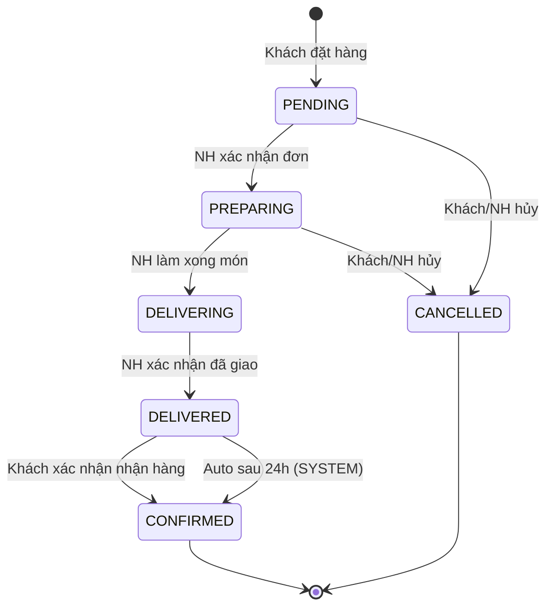
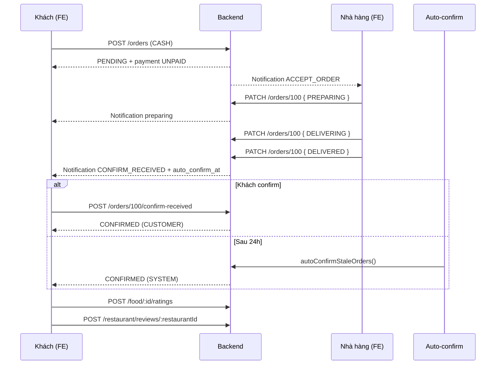

# Order Flow — API Documentation (BE & FE)

Tài liệu mô tả luồng đơn hàng end-to-end giữa **Backend (NestJS)** và **Frontend (Mobile/Web)**.

- Base URL: `/api`
- Auth: `Authorization: Bearer <access_token>` (trừ webhook thanh toán MoMo)
- Response wrapper (mọi API thành công):

```json
{
  "success": true,
  "data": { ... }
}
```

Swagger: `/api/docs`

---

## 1. Tổng quan luồng



| Bước | Ai thực hiện | Backend status | Mô tả |
|------|----------------|----------------|--------|
| 1 | Khách | `PENDING` | Vừa đặt xong, chờ nhà hàng xử lý |
| 2 | Nhà hàng | `PREPARING` | Nhà hàng chấp nhận và bắt đầu làm |
| 3 | Nhà hàng | `DELIVERING` | Món xong, đang giao |
| 4 | Nhà hàng | `DELIVERED` | Đã giao tới khách |
| 5 | Khách / Hệ thống | `CONFIRMED` | Khách xác nhận đã nhận, hoặc auto sau 24h |
| — | Khách / NH | `CANCELLED` | Hủy khi còn `PENDING` hoặc `PREPARING` |

### Lưu ý quan trọng

- **Thanh toán tách biệt khỏi Order status.** MoMo/Cash chỉ cập nhật `Payment.paymentStatus`; không tự động đổi `Order.status`.
- **`CONFIRMED` = khách đã nhận hàng (hoàn tất đơn),** không phải “đã thanh toán”.
- **Đánh giá món / nhà hàng** chỉ được phép khi đơn ở trạng thái `CONFIRMED`.
- **Doanh thu** (admin / nhà hàng) chỉ tính từ đơn `CONFIRMED`.

---

## 2. Mapping status: Backend ↔ Frontend

Backend lưu enum Prisma `OrderStatus`. API trả thêm field map cho UI:

| `backend_status` | `status` (FE) | `status_step` | Ý nghĩa UI gợi ý |
|------------------|---------------|---------------|------------------|
| `PENDING` | `PENDING` | `0` | Chờ nhà hàng xác nhận |
| `PREPARING` | `PREPARING` | `1` | Đang chuẩn bị |
| `DELIVERING` | `DELIVERING` | `2` | Đang giao |
| `DELIVERED` | `DELIVERED` | `3` | Đã giao — chờ khách xác nhận |
| `CONFIRMED` | `CONFIRMED` | `4` | Hoàn tất |
| `CANCELLED` | `CANCELED` | `-1` | Đã hủy (FE dùng 1 chữ L) |

**FE nên dùng `status` + `status_step` để render progress bar.** Dùng `backend_status` khi cần debug hoặc gọi API cập nhật trạng thái.

### Field thời gian (sau khi migrate DB)

Có trên `GET /orders/:orderId`, `GET /orders/:orderId/status`:

| Field | Kiểu | Mô tả |
|-------|------|--------|
| `delivered_at` | ISO string \| null | Thời điểm NH set `DELIVERED` |
| `auto_confirm_at` | ISO string \| null | Thời điểm hệ thống tự `CONFIRMED` (= `delivered_at` + 24h) |
| `hours_until_auto_confirm` | number \| null | Số giờ còn lại trước auto-confirm (chỉ khi `DELIVERED`) |
| `confirmed_at` | ISO string \| null | Thời điểm chuyển `CONFIRMED` |
| `confirmed_by` | `CUSTOMER` \| `SYSTEM` \| `ADMIN` \| null | Ai chốt đơn |

---

## 3. Phân quyền theo role

| Hành động | CUSTOMER | BUSINESS | ADMIN |
|-----------|----------|----------|-------|
| Tạo đơn | ✅ (đơn của mình) | ❌ | ❌ |
| Xem đơn | ✅ (đơn của mình) | ✅ (NH của mình) | ✅ (tất cả) |
| Hủy đơn (`PENDING`, `PREPARING`) | ✅ | ✅ | ✅ |
| `PENDING` → `PREPARING` | ❌ | ✅ | ✅ |
| `PREPARING` → `DELIVERING` | ❌ | ✅ | ✅ |
| `DELIVERING` → `DELIVERED` | ❌ | ✅ | ✅ |
| `DELIVERED` → `CONFIRMED` | ✅ (`confirm-received`) | ❌ | ❌ |
| Xác nhận thanh toán | ❌ | ✅ (NH của mình) | ✅ |
| Đánh giá món / NH | ✅ (đơn `CONFIRMED`) | ❌ | ❌ |

---

## 4. State machine — quy tắc chuyển trạng thái

### Nhà hàng / Admin (`PATCH /orders/:orderId`)

| Từ | Được chuyển sang |
|----|------------------|
| `PENDING` | `PREPARING`, `CANCELLED` |
| `PREPARING` | `DELIVERING`, `CANCELLED` |
| `DELIVERING` | `DELIVERED` |
| `DELIVERED` | ❌ (không được set `CONFIRMED`) |
| `CONFIRMED` / `CANCELLED` | ❌ terminal |

### Khách hàng

| Cách | Từ | Sang |
|------|-----|------|
| `POST /orders/:id/cancel` hoặc `DELETE /orders/:id` | `PENDING`, `PREPARING` | `CANCELLED` |
| `POST /orders/:id/confirm-received` | `DELIVERED` | `CONFIRMED` |

### Auto-confirm (Backend cron)

- Chạy **mỗi giờ**.
- Tìm đơn: `status = DELIVERED` và `autoConfirmAt <= now`.
- Chuyển sang `CONFIRMED`, `confirmedBy = SYSTEM`.
- Gửi notification cho khách.

---

## 5. Thanh toán (tách khỏi Order lifecycle)

App **không tự động** xác nhận thanh toán. NH kiểm tra MoMo / tiền mặt thủ công.

| Phương thức | Khi tạo đơn | Xác nhận thanh toán |
|-------------|-------------|---------------------|
| `CASH` | Tạo `Payment` với `paymentStatus: UNPAID` | `PATCH /api/payment/manage/:paymentId/confirm` |
| `MOMO` | Trả `payUrl` / `qrCodeUrl` (mock nếu chưa cấu hình) | Webhook `POST /api/payment/check-payment` hoặc NH confirm thủ công |

**Confirm payment không đổi `Order.status`.**

### `PATCH /api/payment/manage/:paymentId/confirm`

- **Role:** `BUSINESS` (owner NH) hoặc `ADMIN`
- **Response:** payment với `paymentStatus: DONE`

---

## 6. API Reference — Order

### 6.1. Tạo đơn hàng

`POST /api/orders`

- **Role:** `CUSTOMER`
- **Body:**

```json
{
  "restaurantId": 1,
  "voucherId": 1,
  "savedAddressId": 1,
  "orderFoods": [
    {
      "foodId": 1,
      "quantity": 2,
      "fullText": "Không hành",
      "foodSizeId": 1
    }
  ],
  "note": "Gọi trước khi giao",
  "paymentMethod": "CASH",
  "clearCartAfterOrder": true
}
```

Hoặc dùng `customAddress` thay `savedAddressId` (phải có một trong hai).

| Field | Bắt buộc | Ghi chú |
|-------|----------|---------|
| `restaurantId` | ✅ | |
| `orderFoods` | ✅ | Ít nhất 1 món |
| `paymentMethod` | ✅ | `CASH` \| `MOMO` |
| `savedAddressId` | ⚠️ | Hoặc `customAddress` |
| `voucherId` | ❌ | |
| `clearCartAfterOrder` | ❌ | Mặc định `true` |

- **Kết quả:** `Order.status = PENDING`
- **Response `data`:**

```json
{
  "order": {
    "id": 100,
    "restaurantId": 1,
    "totalPrice": 27.4,
    "deliveryFee": 3.4,
    "status": "PENDING",
    "userId": 99,
    "addressId": 11,
    "note": "..."
  },
  "items": [ { "orderId": 100, "foodId": 1, "quantity": 2, "price": 24 } ],
  "conversation": { "id": 9, "orderId": 100, "customerId": 99, "sellerId": 55 },
  "paymentInformation": { "method": "CASH", "amount": 27.4 }
}
```

MoMo thêm `payUrl`, `qrCodeUrl` trong `paymentInformation`.

- **Side effect:** Notification tới owner NH với `metadata.actions: ["ACCEPT_ORDER", "REJECT_ORDER"]`.

---

### 6.2. Cập nhật trạng thái (Nhà hàng / Admin)

`PATCH /api/orders/:orderId`

- **Role:** `BUSINESS` (owner NH) hoặc `ADMIN`
- **Body:**

```json
{ "status": "PREPARING" }
```

Giá trị `status` hợp lệ: mọi giá trị `OrderStatus` enum, nhưng chỉ transition hợp lệ mới thành công.

**Ví dụ luồng NH:**

```http
PATCH /api/orders/100   { "status": "PREPARING" }    # Accept đơn
PATCH /api/orders/100   { "status": "DELIVERING" }   # Món xong
PATCH /api/orders/100   { "status": "DELIVERED" }    # Đã giao
```

Khi set `DELIVERED`, BE tự ghi `deliveredAt`, `autoConfirmAt` (+24h).

- **Response `data`:** object Order Prisma (raw, gồm `status` backend enum).

---

### 6.3. Khách xác nhận đã nhận hàng

`POST /api/orders/:orderId/confirm-received`

- **Role:** `CUSTOMER` (chủ đơn)
- **Điều kiện:** `backend_status === DELIVERED`
- **Body:** không cần
- **Response `data`:**

```json
{
  "order_id": 100,
  "status": "CONFIRMED",
  "status_step": 4,
  "backend_status": "CONFIRMED",
  "confirmed_by": "CUSTOMER",
  "confirmed_at": "2026-06-24T12:00:00.000Z",
  "message": "Order receipt confirmed successfully"
}
```

---

### 6.4. Hủy đơn

**Cách 1 (FE khuyên dùng):** `POST /api/orders/:orderId/cancel`

**Cách 2:** `DELETE /api/orders/:orderId`

- **Điều kiện:** `PENDING` hoặc `PREPARING`
- **Response cancel compatible:**

```json
{
  "order_id": 100,
  "new_status": "CANCELLED",
  "status": "CANCELED",
  "status_step": -1,
  "message": "Order cancelled successfully"
}
```

---

### 6.5. Danh sách đơn hàng

`GET /api/orders?limit=20&offset=0&status=ongoing`

| Query `status` | Ý nghĩa | Backend filter |
|----------------|---------|----------------|
| `ongoing` | Đang xử lý | `PENDING`, `PREPARING`, `DELIVERING`, `DELIVERED` |
| `history` | Lịch sử | `CONFIRMED`, `CANCELLED` |
| `confirmed` | Chỉ đơn hoàn tất | `CONFIRMED` |
| `PENDING`, `PREPARING`, ... | Lọc enum trực tiếp | Giá trị enum |

- **CUSTOMER:** chỉ thấy đơn của mình.
- **BUSINESS:** đơn thuộc NH mình sở hữu.
- **ADMIN:** tất cả.

**Response khi `status=ongoing`:**

```json
{
  "ongoing_orders": [
    {
      "id": 10,
      "totalPrice": 30,
      "item_count": 2,
      "type": "FOOD",
      "date": "2026-06-24T10:00:00.000Z",
      "status": "PREPARING",
      "status_step": 1,
      "backend_status": "PREPARING",
      "restaurant": { "id": 7, "name": "Rice House", "image": "..." },
      "orderFoods": [ { "id": 3, "name": "Chicken rice", "quantity": 2, "price": 15 } ],
      "payment": { "id": 4, "paymentStatus": "UNPAID", "method": "CASH", "amount": 30 }
    }
  ]
}
```

**Response khi `status=history`:** `{ "history_orders": [ ... ] }` (cùng shape item).

---

### 6.6. Chi tiết đơn hàng

`GET /api/orders/:orderId`

- **Role:** CUSTOMER (chủ đơn) \| BUSINESS (owner NH) \| ADMIN

**Response `data` (rút gọn):**

```json
{
  "id": 100,
  "totalPrice": 45,
  "status": "DELIVERING",
  "status_step": 2,
  "backend_status": "DELIVERING",
  "expected_arrival": "2026-06-24T10:30:00.000Z",
  "delivered_at": null,
  "auto_confirm_at": null,
  "hours_until_auto_confirm": null,
  "confirmed_at": null,
  "confirmed_by": null,
  "user": { "id": 99, "name": "...", "phone": "..." },
  "address": { "title": "Nhà", "fullText": "...", "latitude": 10.77, "longitude": 106.7 },
  "restaurant": { "id": 7, "name": "...", "estimatedDeliveryTime": 30 },
  "orderFoods": [ { "quantity": 2, "price": 45, "food": { "name": "..." } } ],
  "payment": { "amount": 45, "method": "CASH", "paymentStatus": "UNPAID" },
  "conversation": { "id": 88, "orderId": 100 }
}
```

---

### 6.7. Polling trạng thái đơn

`GET /api/orders/:orderId/status`

Dùng cho màn hình tracking — payload nhẹ hơn detail.

```json
{
  "order_id": 100,
  "status": "DELIVERED",
  "status_step": 3,
  "backend_status": "DELIVERED",
  "updated_at": "2026-06-24T11:00:00.000Z",
  "delivered_at": "2026-06-24T11:00:00.000Z",
  "auto_confirm_at": "2026-06-25T11:00:00.000Z",
  "hours_until_auto_confirm": 18,
  "confirmed_at": null,
  "confirmed_by": null
}
```

**FE gợi ý:** poll mỗi 10–30s khi đơn `ongoing`; dừng khi `CONFIRMED` hoặc `CANCELLED`.

---

### 6.8. Đặt lại đơn cũ

`POST /api/orders/:orderId/reorder`

- **Role:** `CUSTOMER`
- Thêm món từ đơn cũ vào giỏ hàng.
- **Response:** thông tin cart cập nhật + `deliveryFee`, `totalPrice`.

---

## 7. API liên quan — Đánh giá (sau `CONFIRMED`)

### Đánh giá món

`POST /api/food/:foodId/ratings`

- **Role:** `CUSTOMER`
- **Body:** `{ "orderId": 100, "vote": 5, "comment": "Ngon" }`
- **Điều kiện:** đơn `CONFIRMED`, có chứa món đó, chưa rate món đó cho đơn này.

`GET /api/food/:foodId/ratings` — xem danh sách đánh giá.

### Đánh giá nhà hàng

`POST /api/restaurant/reviews/:restaurantId`

- **Role:** `CUSTOMER`
- **Body:** `{ "orderId": 100, "vote": 5, "comment": "...", "tags": ["Giao nhanh"] }`
- **Điều kiện:** đơn `CONFIRMED`, thuộc NH đó, chưa review đơn này.

---

## 8. Notifications

| Sự kiện | Người nhận | `metadata` đáng chú ý |
|---------|------------|------------------------|
| Tạo đơn mới | Owner NH | `actions: ["ACCEPT_ORDER", "REJECT_ORDER"]`, `orderId`, `totalPrice` |
| → `PREPARING` | Khách | `status: "PREPARING"` |
| → `DELIVERING` | Khách | `status: "DELIVERING"` |
| → `DELIVERED` | Khách | `actions: ["CONFIRM_RECEIVED"]`, nhắc confirm trong 24h |
| → `CONFIRMED` (khách) | Khách | `confirmedBy: "CUSTOMER"` |
| → `CONFIRMED` (auto) | Khách | `confirmedBy: "SYSTEM"` |
| Hủy đơn | Khách | `status: "CANCELLED"` |
| Xác nhận thanh toán | Khách | `type: PAYMENT` (không đổi order status) |

### FE xử lý action từ notification

| `metadata.actions` | Hành động FE (app NH) | Hành động FE (app Khách) |
|--------------------|------------------------|---------------------------|
| `ACCEPT_ORDER` | `PATCH /orders/:id` `{ "status": "PREPARING" }` | — |
| `REJECT_ORDER` | `PATCH /orders/:id` `{ "status": "CANCELLED" }` | — |
| `CONFIRM_RECEIVED` | — | `POST /orders/:id/confirm-received` |

---

## 9. Hướng dẫn tích hợp Frontend

### 9.1. App Khách hàng

| Màn hình | API | Ghi chú |
|----------|-----|---------|
| Checkout | `POST /orders` | Chọn `CASH` hoặc `MOMO` |
| Đơn đang xử lý | `GET /orders?status=ongoing` | |
| Lịch sử | `GET /orders?status=history` | |
| Tracking | `GET /orders/:id/status` (poll) | Hiển thị `status_step` 0→4 |
| Chi tiết đơn | `GET /orders/:id` | |
| Hủy đơn | `POST /orders/:id/cancel` | Chỉ khi step 0–1 |
| Xác nhận nhận hàng | `POST /orders/:id/confirm-received` | Chỉ khi `status === DELIVERED` |
| Đánh giá | `POST /food/:id/ratings`, `POST /restaurant/reviews/:id` | Sau `CONFIRMED` |

**UI khi `DELIVERED`:**

- Hiện nút **“Đã nhận hàng”** → gọi `confirm-received`.
- Hiện countdown: `hours_until_auto_confirm` giờ (hoặc parse `auto_confirm_at`).
- Copy gợi ý: *“Đơn sẽ tự hoàn tất sau X giờ nếu bạn không xác nhận.”*

**Progress bar gợi ý (5 bước):**

```
[0 PENDING] → [1 PREPARING] → [2 DELIVERING] → [3 DELIVERED] → [4 CONFIRMED]
```

`CANCELED` → hiển thị trạng thái terminal, ẩn progress.

### 9.2. App Nhà hàng

| Màn hình | API | Ghi chú |
|----------|-----|---------|
| Đơn mới | `GET /orders?status=PENDING` | Hoặc từ notification |
| Accept đơn | `PATCH /orders/:id` `{ "status": "PREPARING" }` | |
| Đang làm | `PATCH` → `DELIVERING` | |
| Đã giao | `PATCH` → `DELIVERED` | |
| Xác nhận thanh toán | `PATCH /payment/manage/:paymentId/confirm` | Không ảnh hưởng order status |
| Đơn chờ khách confirm | `GET /orders?status=ongoing` | Lọc `DELIVERED` phía client hoặc dùng list chung |

**Dashboard NH (gợi ý mapping):**

- `orderRequest` ≈ đếm `PENDING`
- `runningOrders` ≈ `PREPARING` + `DELIVERING` + `DELIVERED`
- `revenue` ≈ tổng đơn `CONFIRMED`

---

## 10. Mã lỗi thường gặp

| HTTP | Message (ví dụ) | Nguyên nhân |
|------|-----------------|-------------|
| `400` | `Cannot transition order from PENDING to DELIVERED` | Nhảy bước status không hợp lệ |
| `400` | `Only pending or active orders can be cancelled` | Hủy khi đã `DELIVERING` trở đi |
| `400` | `Order is already in the requested status` | Gửi lại cùng status |
| `400` | `Cannot update an order in CONFIRMED status` | Đơn đã hoàn tất |
| `403` | `Customers are only allowed to cancel orders or confirm receipt` | Khách gọi `PATCH` status sai |
| `403` | `You are not allowed to access this order` | Xem/sửa đơn không thuộc quyền |
| `404` | `Order not found` | `orderId` không tồn tại |

---

## 11. Checklist tích hợp nhanh

### Backend (đã có trong source)

- [x] State machine chuyển status
- [x] `POST /orders/:id/confirm-received`
- [x] Auto-confirm cron 24h
- [x] Payment tách khỏi order status
- [x] Đánh giá chỉ khi `CONFIRMED`
- [ ] Chạy migration DB (`deliveredAt`, `confirmedAt`, `confirmedBy`, `autoConfirmAt`)

### Frontend

- [ ] Map `status` / `status_step` cho UI tracking
- [ ] Màn `DELIVERED`: nút confirm + countdown auto-confirm
- [ ] Poll `GET /orders/:id/status` khi ongoing
- [ ] NH: flow `PREPARING` → `DELIVERING` → `DELIVERED`
- [ ] Màn đánh giá: chỉ enable khi `backend_status === CONFIRMED`
- [ ] Xử lý notification actions `ACCEPT_ORDER`, `CONFIRM_RECEIVED`
- [ ] Không expect payment confirm → đổi order status

---

## 12. Ví dụ sequence đầy đủ



---

*Tài liệu đồng bộ với source tại `src/modules/order/`, `src/modules/payment/`, `src/modules/food/`, `src/modules/restaurant/`.*
