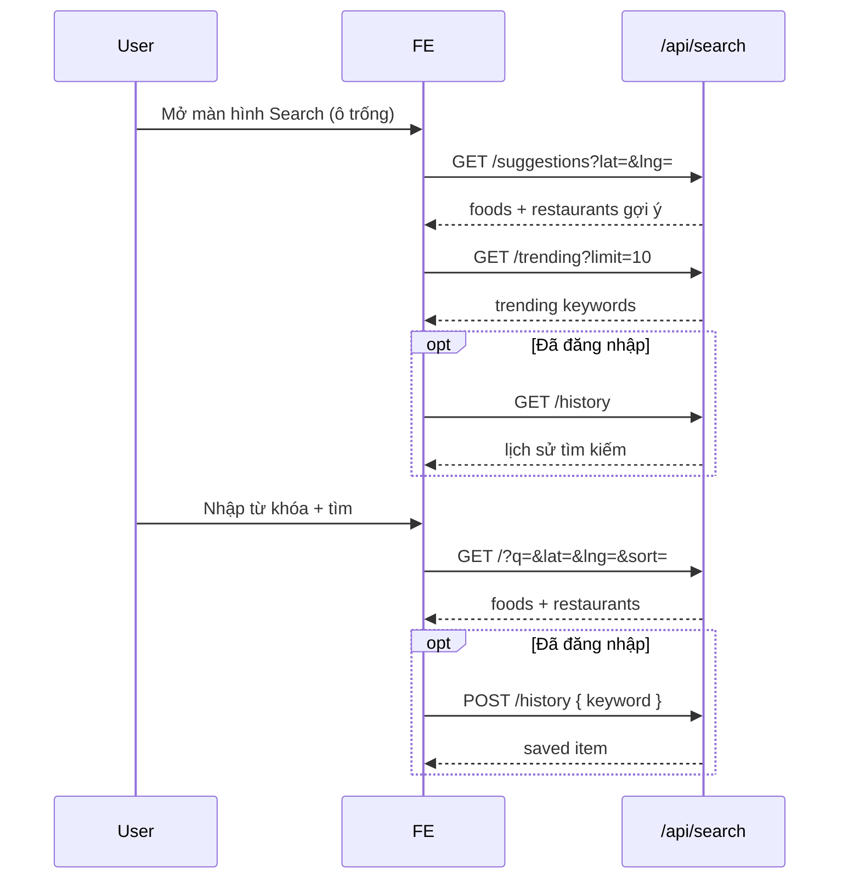

# Search API Documentation

Tài liệu dành cho Frontend tích hợp module **Tìm kiếm & Gợi ý**.

---

## Thông tin chung

| Mục | Giá trị |
|---|---|
| Base URL | `{HOST}/api/search` |
| Ví dụ local | `http://localhost:4000/api/search` |
| Content-Type | `application/json` |
| Global prefix | `/api` |

### Response envelope (áp dụng mọi endpoint)

Backend bọc response qua `TransformInterceptor`. FE **luôn parse theo format bên dưới**, không dùng body thô từ controller.

**Thành công — có `data`:**

```json
{
  "success": true,
  "data": {}
}
```

**Thành công — có `message` + `data`:**

```json
{
  "success": true,
  "message": "Save search history successfully",
  "data": {}
}
```

**Thành công — chỉ có `message`:**

```json
{
  "success": true,
  "message": "Clear search history successfully"
}
```

**Lỗi (4xx / 5xx):**

```json
{
  "success": false,
  "path": "/api/search/history/99",
  "notifi": "Cloudian Notification!!!",
  "statusCode": 404,
  "message": "History item not found"
}
```

### Authentication

| Endpoint | Auth |
|---|---|
| `GET /` | Public |
| `GET /suggestions` | Public |
| `GET /trending` | Public |
| `GET /history` | Bearer Token (bắt buộc) |
| `POST /history` | Bearer Token (bắt buộc) |
| `DELETE /history` | Bearer Token (bắt buộc) |
| `DELETE /history/:id` | Bearer Token (bắt buộc) |

Header khi cần auth:

```http
Authorization: Bearer <access_token>
```

---

## Shared Types

### FoodItem

Dùng trong response của **Unified Search** và **Suggestions**.

| Field | Type | Nullable | Mô tả |
|---|---|:---:|---|
| `id` | `number` | | ID món ăn |
| `name` | `string` | | Tên món |
| `price` | `number` | | Giá (đã convert từ Decimal) |
| `imageUrl` | `string` | | Đường dẫn/key ảnh món (FE tự build URL MinIO/CDN nếu cần) |
| `restaurantId` | `number` | | ID nhà hàng bán món |
| `restaurantName` | `string` | | Tên nhà hàng |
| `rating` | `number` | | Điểm đánh giá (1 chữ số thập phân). Trung bình `FoodRating` nếu có review, fallback `Food.rating` |
| `soldCount` | `number` | | Tổng số lượng đã bán từ đơn `CONFIRMED` (khách đã xác nhận nhận hàng) |

```json
{
  "id": 1,
  "name": "Bún Chả Hà Nội",
  "price": 45000,
  "imageUrl": "foods/buncha.jpg",
  "restaurantId": 101,
  "restaurantName": "Bún Chả Hương Liên",
  "rating": 4.8,
  "soldCount": 120
}
```

> **Voucher trên food card:** Lấy từ `restaurants[].vouchers` theo `restaurantId` (cùng format `GET /api/vouchers/customer/:restaurantId`).

### CustomerVoucher

Cùng schema với response `GET /api/vouchers/customer/:restaurantId`.

| Field | Type | Nullable | Mô tả |
|---|---|:---:|---|
| `id` | `number` | | ID voucher |
| `name` | `string` | | Tên voucher |
| `code` | `string` | | Mã voucher |
| `description` | `string` | | Mô tả |
| `image` | `string` | | Key/path ảnh voucher |
| `sale` | `number` | | Giá trị giảm (% hoặc số tiền tùy `type`) |
| `type` | `string` | | `PERCENT` hoặc `MONEY` |
| `status` | `string` | | `APPLYING` |
| `restaurantId` | `number` | | ID nhà hàng |
| `minimumOrderAmount` | `string \| number` | | Đơn tối thiểu (Decimal) |
| `maximumDiscountAmount` | `string \| number \| null` | ✓ | Giảm tối đa |
| `startAt` | `string` | | Thời gian bắt đầu (ISO 8601) |
| `endAt` | `string` | | Thời gian kết thúc (ISO 8601) |
| `createdAt` | `string` | | |
| `updatedAt` | `string` | | |
| `restaurant` | `object` | | `{ id, name }` |

### RestaurantItem

Dùng trong response của **Unified Search** và **Suggestions**.

| Field | Type | Nullable | Mô tả |
|---|---|:---:|---|
| `id` | `number` | | ID nhà hàng |
| `name` | `string` | | Tên nhà hàng |
| `imageUrl` | `string` | | Đường dẫn/key ảnh nhà hàng |
| `averageRating` | `number` | | Điểm trung bình từ `RestaurantRating` (1 chữ số thập phân) |
| `deliveryFee` | `number` | | Phí giao hàng |
| `distance` | `number` | | Khoảng cách (km, 1 chữ số thập phân). Xem quy tắc bên dưới |
| `tags` | `string[]` | | Danh sách tên danh mục món (dedupe) mà nhà hàng đang phục vụ |
| `hasVoucher` | `boolean` | | `true` nếu `vouchers.length > 0` |
| `vouchers` | `CustomerVoucher[]` | | Danh sách voucher đang active (giống customer API) |

**Quy tắc `distance`:**

- Có truyền `lat` + `lng` và nhà hàng có tọa độ hợp lệ → trả khoảng cách Haversine thực tế (km).
- Không truyền `lat`/`lng` → luôn trả `0` (kể cả endpoint search).
- Unified Search **không** trả `distance` trong object `foods` (chỉ restaurants).

```json
{
  "id": 101,
  "name": "Bún Chả Hương Liên",
  "imageUrl": "restaurants/huonglien.jpg",
  "averageRating": 4.8,
  "deliveryFee": 15000,
  "distance": 1.2,
  "tags": ["Bún chả", "Đặc sản"],
  "hasVoucher": true,
  "vouchers": [
    {
      "id": 1,
      "name": "Summer Sale",
      "code": "SUMMER10",
      "description": "",
      "image": "",
      "sale": 10,
      "type": "PERCENT",
      "status": "APPLYING",
      "restaurantId": 101,
      "minimumOrderAmount": "50000",
      "maximumDiscountAmount": null,
      "startAt": "2026-01-01T00:00:00.000Z",
      "endAt": "2026-12-31T23:59:59.000Z",
      "createdAt": "2026-01-01T00:00:00.000Z",
      "updatedAt": "2026-01-01T00:00:00.000Z",
      "restaurant": {
        "id": 101,
        "name": "Bún Chả Hương Liên"
      }
    }
  ]
}
```

### SearchHistoryItem

| Field | Type | Mô tả |
|---|---|---|
| `id` | `number` | ID bản ghi lịch sử |
| `keyword` | `string` | Từ khóa đã tìm (đã trim) |
| `createdAt` | `string` (ISO 8601) | Thời điểm lưu / cập nhật gần nhất |

### TrendingKeywordItem

| Field | Type | Mô tả |
|---|---|---|
| `keyword` | `string` | Từ khóa thịnh hành |
| `searchCount` | `number` | Số lần được lưu vào lịch sử trong 7 ngày qua |

---

## 1. Unified Search — Tìm kiếm hợp nhất

Tìm đồng thời **món ăn** và **nhà hàng** theo từ khóa. Dùng khi user nhập từ khóa và submit, hoặc sau debounce ô search.

### Request

```http
GET /api/search
```

**Query parameters:**

| Param | Type | Required | Default | Validation | Mô tả |
|---|---|:---:|---|---|---|
| `q` | `string` | ✓ | — | Không rỗng sau trim | Từ khóa tìm kiếm |
| `lat` | `number` | | — | Số hợp lệ | Vĩ độ user (tính khoảng cách & sort) |
| `lng` | `number` | | Số hợp lệ | Kinh độ user |
| `limit` | `integer` | | `20` | `≥ 1` | Số bản ghi tối đa **mỗi loại** (foods và restaurants riêng biệt) |
| `offset` | `integer` | | `0` | `≥ 0` | Số bản ghi bỏ qua **mỗi loại** (phân trang độc lập) |
| `sort` | `string` | | — | `distance` \| `rating` \| `price_low_to_high` | Tiêu chí sắp xếp |
| `categoryId` | `integer` | | — | `≥ 1` | Lọc theo danh mục món ăn |

**Ví dụ request:**

```http
GET /api/search?q=b%C3%BAn%20ch%E1%BA%A3&lat=10.762622&lng=106.660172&limit=20&offset=0&sort=rating&categoryId=1
```

```typescript
// Axios example
const { data } = await axios.get('/api/search', {
  params: {
    q: 'bún chả',
    lat: 10.762622,
    lng: 106.660172,
    limit: 20,
    offset: 0,
    sort: 'rating',       // optional
    categoryId: 1,        // optional
  },
});
// data.success === true
// data.data.foods, data.data.restaurants
```

### Response `200 OK`

```json
{
  "success": true,
  "data": {
    "foods": [
      {
        "id": 1,
        "name": "Bún Chả Hà Nội",
        "price": 45000,
        "imageUrl": "foods/buncha.jpg",
        "restaurantId": 101,
        "restaurantName": "Bún Chả Hương Liên",
        "rating": 4.8,
        "soldCount": 120
      }
    ],
    "restaurants": [
      {
        "id": 101,
        "name": "Bún Chả Hương Liên",
        "imageUrl": "restaurants/huonglien.jpg",
        "averageRating": 4.8,
        "deliveryFee": 15000,
        "distance": 1.2,
        "tags": ["Bún chả", "Đặc sản"],
        "hasVoucher": true,
        "vouchers": [
          {
            "id": 1,
            "name": "Summer Sale",
            "code": "SUMMER10",
            "sale": 10,
            "type": "PERCENT",
            "status": "APPLYING",
            "restaurantId": 101,
            "restaurant": { "id": 101, "name": "Bún Chả Hương Liên" }
          }
        ]
      }
    ]
  }
}
```

### Business rules

**Tìm kiếm món ăn (`foods`):**

- Match `q` (không phân biệt hoa thường) trong: `Food.name`, `Food.label`, hoặc `Category.name`.
- Chỉ món: `isAvailable = true`, chưa xóa, category active, nhà hàng `APPROVED` + `isActive`.
- **Voucher:** `restaurants[].vouchers` dùng cùng logic `GET /api/vouchers/customer/:restaurantId` (`APPLYING`, `startAt <= now`, `endAt >= now`, nhà hàng active).

**Tìm kiếm nhà hàng (`restaurants`):**

- Match tên nhà hàng **HOẶC** có món ăn thỏa điều kiện tìm kiếm ở trên.
- Nếu có `categoryId`: nhà hàng phải có ít nhất 1 món thuộc danh mục đó.

**Sắp xếp `foods`:**

| `sort` | Điều kiện | Thứ tự |
|---|---|---|
| `distance` | Cần `lat` + `lng` | Gần → xa |
| `rating` | — | Cao → thấp |
| `price_low_to_high` | — | Rẻ → đắt |
| *(mặc định)* | — | `updatedAt` mới nhất trước |

**Sắp xếp `restaurants`:**

| `sort` | Điều kiện | Thứ tự |
|---|---|---|
| `distance` | Cần `lat` + `lng` | Gần → xa |
| `rating` | — | `averageRating` cao → thấp |
| `price_low_to_high` hoặc mặc định | — | `createdAt` mới nhất trước |

> **Lưu ý FE:** `sort=distance` mà không gửi `lat`/`lng` → backend fallback sort mặc định, không báo lỗi.

**Phân trang:**

- `limit` / `offset` áp dụng **độc lập** cho `foods` và `restaurants`.
- Ví dụ: `limit=10, offset=10` → lấy bản ghi 11–20 của cả hai danh sách.
- Response **không** có `total` / `hasMore` — FE cần tự suy luận (nếu length < limit thì hết trang).

### Error responses

| Status | Khi nào | `message` ví dụ |
|---|---|---|
| `400` | `q` rỗng, `sort` không hợp lệ, `limit`/`offset`/`categoryId` sai | Validation error array |

---

## 2. Search Suggestions — Gợi ý mặc định

Hiển thị khi ô search **trống** (Suggested Foods + Suggested Restaurants).

### Request

```http
GET /api/search/suggestions
```

**Query parameters:**

| Param | Type | Required | Default | Validation | Mô tả |
|---|---|:---:|---|---|---|
| `lat` | `number` | | — | Số hợp lệ | Vĩ độ user |
| `lng` | `number` | | — | Số hợp lệ | Kinh độ user |
| `limit` | `integer` | | `10` | `≥ 1` | Số gợi ý tối đa **mỗi loại** |

**Ví dụ request:**

```http
GET /api/search/suggestions?lat=10.762622&lng=106.660172&limit=10
```

### Response `200 OK`

```json
{
  "success": true,
  "data": {
    "foods": [
      {
        "id": 1,
        "name": "Burger phô mai",
        "price": 55000,
        "imageUrl": "foods/burger.jpg",
        "restaurantId": 101,
        "restaurantName": "Burger Town",
        "rating": 4.8,
        "soldCount": 150
      }
    ],
    "restaurants": [
      {
        "id": 101,
        "name": "Burger Town",
        "imageUrl": "restaurants/burger-town.jpg",
        "averageRating": 4.8,
        "deliveryFee": 15000,
        "distance": 2.3,
        "tags": ["Burger", "Fast Food"],
        "hasVoucher": true,
        "vouchers": []
      }
    ]
  }
}
```

### Business rules

**Foods (bán chạy):**

- Lấy top món theo tổng `quantity` từ đơn `CONFIRMED`, giữ đúng thứ tự bán chạy.
- Nếu thiếu so với `limit` → bổ sung món rating cao.
- Tối đa `limit` món.

**Restaurants:**

- Điều kiện: `APPROVED` + `isActive` + (**có voucher đang APPLYING** HOẶC **`averageRating ≥ 4.5`**).
- **Có `lat`/`lng`:** lọc trong bán kính **10 km**, sort gần → xa.
- **Không có tọa độ hoặc không có nhà hàng trong 10 km:** fallback toàn hệ thống, sort rating cao → thấp, rồi `createdAt` mới nhất.
- Không có `lat`/`lng` → `distance = 0`.

---

## 3. Search History — Lịch sử tìm kiếm

### 3.1 Lấy danh sách lịch sử

```http
GET /api/search/history
Authorization: Bearer <token>
```

**Request body / query:** Không có.

### Response `200 OK`

```json
{
  "success": true,
  "data": [
    {
      "id": 1,
      "keyword": "bún chả",
      "createdAt": "2026-06-22T13:49:30.000Z"
    },
    {
      "id": 2,
      "keyword": "trà sữa",
      "createdAt": "2026-06-21T09:15:00.000Z"
    }
  ]
}
```

- Sắp xếp: `createdAt` giảm dần (mới nhất trên cùng).
- Mỗi user chỉ thấy lịch sử của mình.

### Error responses

| Status | Khi nào |
|---|---|
| `401` | Thiếu / token hết hạn |

---

### 3.2 Lưu từ khóa vào lịch sử

Gọi sau khi user thực hiện tìm kiếm (submit hoặc chọn từ gợi ý).

```http
POST /api/search/history
Authorization: Bearer <token>
Content-Type: application/json
```

**Request body:**

| Field | Type | Required | Validation | Mô tả |
|---|---|:---:|---|---|
| `keyword` | `string` | ✓ | Không rỗng sau trim | Từ khóa cần lưu |

```json
{
  "keyword": "bún chả"
}
```

```typescript
await axios.post(
  '/api/search/history',
  { keyword: 'bún chả' },
  { headers: { Authorization: `Bearer ${token}` } },
);
```

**Upsert logic:**

- Cặp `(userId, keyword)` unique.
- Keyword đã tồn tại → cập nhật `createdAt = now` (đẩy lên đầu danh sách).
- Keyword mới → tạo bản ghi mới.

### Response `200 OK`

```json
{
  "success": true,
  "message": "Save search history successfully",
  "data": {
    "id": 1,
    "userId": 99,
    "keyword": "bún chả",
    "createdAt": "2026-06-22T13:49:30.000Z"
  }
}
```

### Error responses

| Status | Khi nào |
|---|---|
| `400` | `keyword` rỗng |
| `401` | Chưa đăng nhập |

---

### 3.3 Xóa toàn bộ lịch sử

```http
DELETE /api/search/history
Authorization: Bearer <token>
```

**Request body / query:** Không có.

### Response `200 OK`

```json
{
  "success": true,
  "message": "Clear search history successfully"
}
```

Hard delete toàn bộ bản ghi `SearchHistory` của user hiện tại.

---

### 3.4 Xóa một từ khóa cụ thể

```http
DELETE /api/search/history/:id
Authorization: Bearer <token>
```

**Path parameters:**

| Param | Type | Required | Mô tả |
|---|---|:---:|---|
| `id` | `integer` | ✓ | ID bản ghi lịch sử |

**Ví dụ:**

```http
DELETE /api/search/history/5
```

### Response `200 OK`

```json
{
  "success": true,
  "message": "Delete history item successfully"
}
```

### Error responses

| Status | Khi nào | `message` |
|---|---|---|
| `401` | Chưa đăng nhập | Unauthorized |
| `403` | Bản ghi thuộc user khác | `You do not have permission to delete this history item` |
| `404` | ID không tồn tại | `History item not found` |

---

## 4. Trending Keywords — Từ khóa thịnh hành

Lấy từ khóa được tìm nhiều nhất trong **7 ngày qua** (dựa trên bảng `SearchHistory`).

### Request

```http
GET /api/search/trending
```

**Query parameters:**

| Param | Type | Required | Default | Validation | Mô tả |
|---|---|:---:|---|---|---|
| `limit` | `integer` | | `10` | `≥ 1` | Số từ khóa tối đa |

**Ví dụ:**

```http
GET /api/search/trending?limit=5
```

### Response `200 OK`

```json
{
  "success": true,
  "data": [
    {
      "keyword": "trà sữa",
      "searchCount": 150
    },
    {
      "keyword": "pizza",
      "searchCount": 98
    }
  ]
}
```

- Sắp xếp: `searchCount` giảm dần.
- Public — không cần token.

---

## Luồng tích hợp FE (gợi ý)



### Checklist FE

- [ ] Parse `response.data.data` (không phải body trực tiếp từ service).
- [ ] Endpoint history/trending: `data` là **array** trực tiếp, không nested thêm `{ success, data }`.
- [ ] `POST /history`, `DELETE /history`: đọc `message` ở top level cùng `success`.
- [ ] Trim từ khóa phía FE trước khi gửi (BE cũng trim, nhưng nên đồng bộ UX).
- [ ] Gửi `lat`/`lng` khi có quyền location để sort/filter distance chính xác.
- [ ] Phân trang search: tăng `offset` theo bước `limit` cho **foods** và **restaurants** riêng.
- [ ] `imageUrl` có thể là key MinIO — build URL đầy đủ theo convention app (tham khảo module Home).

---

## TypeScript types (copy-paste)

```typescript
// Envelope
interface ApiSuccessResponse<T> {
  success: true;
  data: T;
}

interface ApiMessageResponse {
  success: true;
  message: string;
}

interface ApiMessageDataResponse<T> {
  success: true;
  message: string;
  data: T;
}

interface ApiErrorResponse {
  success: false;
  path: string;
  notifi: string;
  statusCode: number;
  message: string | string[];
}

// Search types
interface FoodItem {
  id: number;
  name: string;
  price: number;
  imageUrl: string;
  restaurantId: number;
  restaurantName: string;
  rating: number;
  soldCount: number;
}

interface CustomerVoucher {
  id: number;
  name: string;
  code: string;
  description: string;
  image: string;
  sale: number;
  type: 'PERCENT' | 'MONEY';
  status: string;
  restaurantId: number;
  minimumOrderAmount: string | number;
  maximumDiscountAmount: string | number | null;
  startAt: string;
  endAt: string;
  createdAt: string;
  updatedAt: string;
  restaurant: {
    id: number;
    name: string;
  };
}

interface RestaurantItem {
  id: number;
  name: string;
  imageUrl: string;
  averageRating: number;
  deliveryFee: number;
  distance: number;
  tags: string[];
  hasVoucher: boolean;
  vouchers: CustomerVoucher[];
}

interface SearchResultData {
  foods: FoodItem[];
  restaurants: RestaurantItem[];
}

interface SearchHistoryItem {
  id: number;
  keyword: string;
  createdAt: string;
}

interface TrendingKeywordItem {
  keyword: string;
  searchCount: number;
}

// Query params
interface SearchQueryParams {
  q: string;
  lat?: number;
  lng?: number;
  limit?: number;
  offset?: number;
  sort?: 'distance' | 'rating' | 'price_low_to_high';
  categoryId?: number;
}

interface SearchSuggestionsQueryParams {
  lat?: number;
  lng?: number;
  limit?: number;
}

interface TrendingQueryParams {
  limit?: number;
}

interface SaveSearchHistoryBody {
  keyword: string;
}
```

---

## Swagger / Scalar

Interactive docs: `http://localhost:4000/api/docs` → tag **16. Search**.
