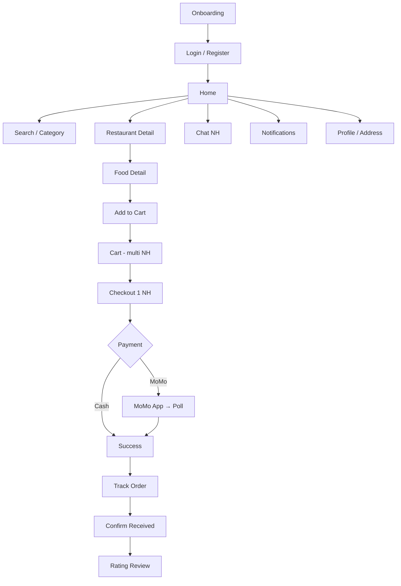

# Customer Journey — End-to-End

Luồng hành trình khách hàng, map tới learning docs và file source chính.

## Chi tiết từng bước

| Bước | User action | Learning doc | File chính |
|------|-------------|--------------|------------|
| 1 | Lần đầu mở app | [auth-session.md](../learning/auth-session.md) | `OnboardingScreen`, `MainViewModel` |
| 2 | Đăng nhập | [auth-session.md](../learning/auth-session.md) | `LoginViewModel`, `LoginUseCase` |
| 3 | Xem Home | [home.md](../learning/home.md) | `HomeViewModel` |
| 4 | Chọn địa chỉ giao | [delivery-location.md](../learning/delivery-location.md) | `DeliveryLocationRepositoryImpl` |
| 5 | Tìm kiếm | [search.md](../learning/search.md) | `SearchViewModel` |
| 6 | Xem NH / món | — | `RestaurantDetailScreen`, `FoodDetailScreen` |
| 7 | Thêm giỏ | [cart.md](../learning/cart.md) | `CartRepositoryImpl.addToCartWithOptimisticLocal` |
| 8 | Xem giỏ | [cart.md](../learning/cart.md) | `CartScreen`, `CartViewModel` |
| 9 | Checkout | [checkout-payment.md](../learning/checkout-payment.md) | `CheckoutViewModel` |
| 10 | Thanh toán MoMo | [checkout-payment.md](../learning/checkout-payment.md) | `OpenMoMoApp` effect, poll payment |
| 11 | Theo dõi đơn | [order-tracking.md](../learning/order-tracking.md) | `TrackOrderViewModel` |
| 12 | Xác nhận nhận hàng | [order-tracking.md](../learning/order-tracking.md) | `confirmReceived()` |
| 13 | Đánh giá | [rating-review.md](../learning/rating-review.md) | `RatingReviewScreen` |
| 14 | Chat NH | [chat.md](../learning/chat.md) | `ChatViewModel` |
| 15 | Xem thông báo | [notification.md](../learning/notification.md) | `NotificationViewModel` |
| 16 | Quản lý địa chỉ | [address.md](../learning/address.md) | `AddAddressViewModel` |

## Demo scenarios (test full journey)

### Journey A — Đặt hàng Cash
1. Login customer
2. Home → chọn NH → thêm 2 món
3. Cart → Checkout NH đó → Cash
4. Track order → chờ NH đổi status (hoặc test account)
5. Confirm received → Rating

### Journey B — Multi-restaurant cart
1. Thêm món NH A và NH B
2. Checkout chỉ NH A
3. Verify cart còn NH B

### Journey C — Chat từ order
1. Vào Track Order → Chat
2. `InitChatFromOrder` → create conversation nếu chưa có
3. Gửi tin → optimistic → socket ack

## Cross-cutting concerns

| Concern | Doc |
|---------|-----|
| Navigation | [navigation.md](../learning/navigation.md) |
| Patterns | [patterns.md](../learning/patterns.md) |
| Debug | [troubleshooting.md](../troubleshooting.md) |
