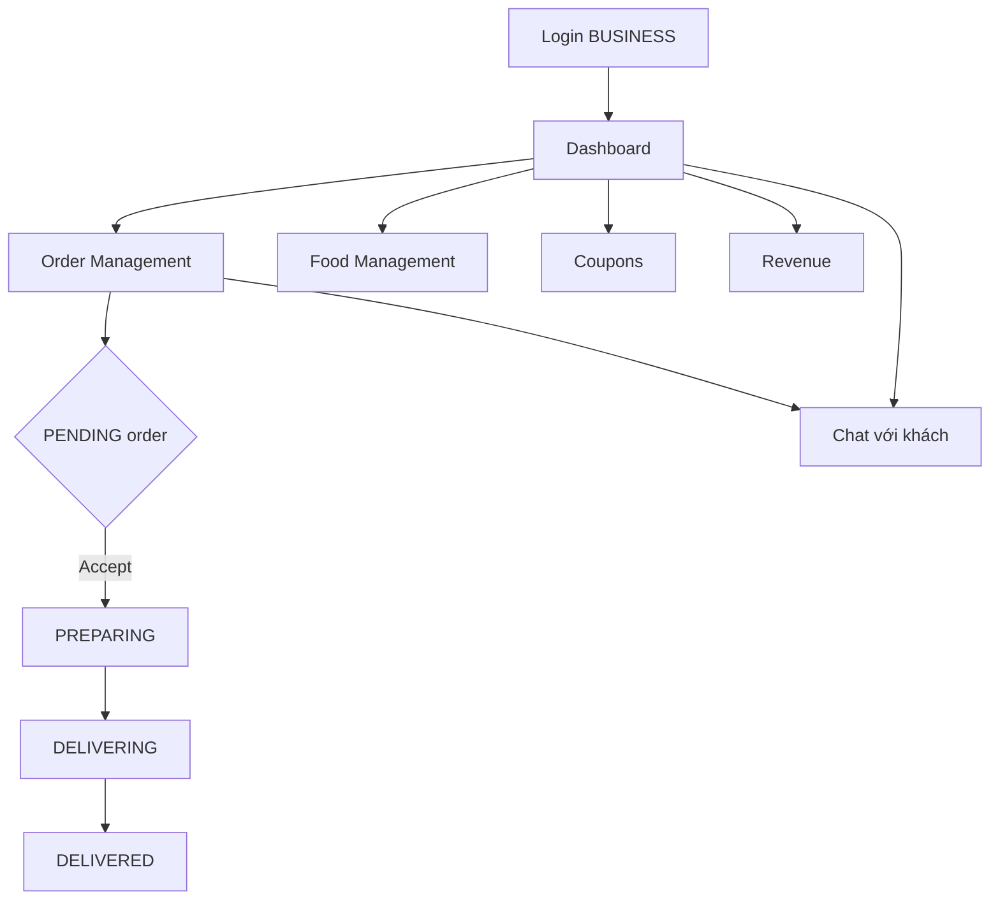
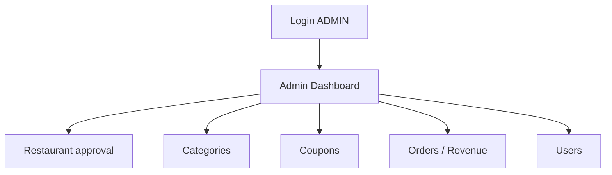

# Restaurant & Admin Journey

## Restaurant (BUSINESS) flow

| Bước | Learning doc | File chính |
|------|--------------|------------|
| Login role BUSINESS | [auth-session.md](../learning/auth-session.md) | `toStartDestination()` |
| Dashboard | [restaurant-admin.md](../learning/restaurant-admin.md) | `DashboardScreen` |
| Nhận / xử lý đơn | [restaurant-admin.md](../learning/restaurant-admin.md) | `OrderManagementScreen` |
| Push đơn mới | [notification.md](../learning/notification.md) | FCM + `ACCEPT_ORDER` action |
| Sửa thực đơn | [restaurant-admin.md](../learning/restaurant-admin.md) | `EditFoodViewModel` |
| Chat khách | [chat.md](../learning/chat.md) | `ChatViewModel` — không create conversation |
| Xem review | [rating-review.md](../learning/rating-review.md) | `DashBoardReview` |

### Restaurant demo scenario

1. Login tài khoản NH
2. Nhận notification đơn PENDING
3. Order Management → Accept → PREPARING
4. Chuyển DELIVERING → khách thấy ETA trên Track Order
5. DELIVERED → khách confirm → CONFIRMED

---

## Admin flow

| Bước | Doc | File |
|------|-----|------|
| Admin graph | [navigation.md](../learning/navigation.md) | `AdminGraph`, `AdminBottomBar` |
| Duyệt NH | [restaurant-admin.md](../learning/restaurant-admin.md) | `AdminRestaurantScreen` |
| Category CRUD | [restaurant-admin.md](../learning/restaurant-admin.md) | `AdminCategoryScreen` |
| API spec | [ADMIN_DASHBOARD.md](../ADMIN_DASHBOARD.md) | — |

### Admin demo scenario

1. Login admin
2. Duyệt restaurant pending (notification SYSTEM → `RestaurantApproval` destination)
3. Tạo category mới → verify hiện trên customer Home

## Shared với Customer

| Feature | Khác biệt theo role |
|---------|---------------------|
| Chat | `resolveOtherUser` — NH thấy tên customer |
| Notification | Admin/NH nhận ORDER actions |
| Navigation | Graph riêng, bottom bar riêng |
