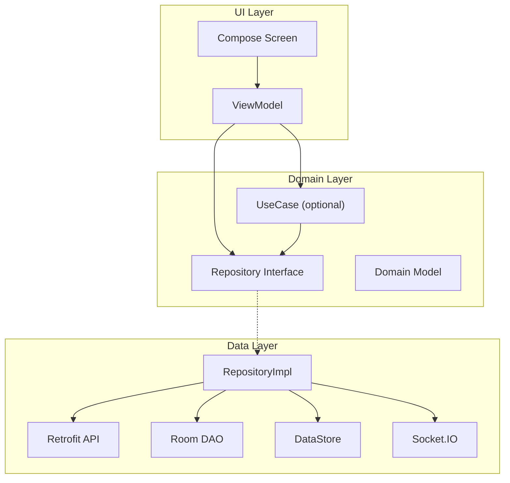

# Architecture — Kiến trúc DFood Android

## 1. Bài toán

Xây dựng app food delivery với:
- Nhiều role: **Customer**, **Restaurant (BUSINESS)**, **Admin**
- Nhiều luồng realtime (chat), offline cache (notification, cart local)
- Dễ test, dễ mở rộng tính năng mới

## 2. Kiến trúc đã chọn

**Clean Architecture + MVVM** trên Jetpack Compose.



### Nguyên tắc phụ thuộc

- UI **không** gọi trực tiếp Retrofit hay Room
- Domain **không** import Android framework (trừ vài exception nhỏ)
- Data implement interface từ Domain

## 3. Package structure

```
app/src/main/java/com/example/fooddelivery/
├── MainActivity.kt / MainViewModel.kt     # Entry, splash, session bootstrap
├── di/
│   ├── AppModule.kt                       # Room, Repository bindings
│   └── NetworkModule.kt                   # Retrofit, OkHttp, interceptors
├── domain/
│   ├── model/                             # Business entities
│   ├── repository/                        # Interfaces
│   └── usecase/                           # Single-responsibility actions
├── data/
│   ├── remote/api/                        # Retrofit interfaces
│   ├── remote/dto/                        # API request/response
│   ├── remote/socket/                     # ChatSocketManager
│   ├── local/room/                        # Entities, DAOs, AppDatabase
│   ├── local/datastore/                   # TokenManager, DataStoreManager
│   └── repository/                        # *RepositoryImpl
├── ui/
│   ├── navigation/                        # NavGraph, Routes
│   ├── screens/                           # Feature screens + ViewModels
│   ├── components/                        # Shared UI
│   └── theme/
├── service/                               # DFoodMessagingService (FCM)
├── services/                              # ChatSocketService
└── util/                                  # Pure helpers (OrderEta, ChatMessageTime)
```

## 4. Dependency Injection — Hilt

| Module | Cung cấp |
|--------|----------|
| `AppModule` | Room DB, DAOs, tất cả `Repository` bindings |
| `NetworkModule` | `OkHttpClient`, `Retrofit`, API interfaces, `ChatSocketManager` |

ViewModel inject qua `@HiltViewModel` + constructor `@Inject`.

## 5. State management trong ViewModel

Pattern chuẩn của project:

```kotlin
// State — data hiển thị UI
data class XxxState(val isLoading: Boolean = false, ...)

// Event — user action
sealed interface XxxEvent {
    data object Load : XxxEvent
}

// UiEffect (optional) — one-shot: navigation, snackbar, open external app
sealed interface XxxUiEffect {
    data class Navigate(val route: Any) : XxxUiEffect
}

@HiltViewModel
class XxxViewModel @Inject constructor(...) : ViewModel() {
    private val _state = MutableStateFlow(XxxState())
    val state: StateFlow<XxxState> = _state.asStateFlow()

    private val _uiEffect = MutableSharedFlow<XxxUiEffect>()
    val uiEffect = _uiEffect.asSharedFlow()

    fun onEvent(event: XxxEvent) { ... }
}
```

**Tại sao tách UiEffect?** Navigation / MoMo deeplink không nên nằm trong `State` — tránh re-compose trigger navigate nhiều lần.

Xem thêm: [../cookbook/ui-effect-navigation.md](../cookbook/ui-effect-navigation.md)

## 6. Navigation

- **Type-safe routes** với `@Serializable` (`Routes.kt`)
- **Nested graphs:** `AuthGraph`, `CustomerGraph`, `RestaurantGraph`, `AdminGraph`
- Start destination resolve từ role sau login (`toStartDestination()`)

Chi tiết: [navigation.md](navigation.md)

## 7. Local persistence

| Storage | Dùng cho | Source of truth |
|---------|----------|-----------------|
| **DataStore** | Access/refresh token, onboarding, dark mode, selected address id, notification toggle | Client preferences |
| **Room** | Notifications, messages, conversations, cart items | Cache — sync từ server (trừ cart optimistic window) |

Room schema version: **8** (`AppDatabase.kt`)

## 8. Network

- **REST:** Retrofit + `unwrapData()` wrapper cho `{ success, data }`
- **Socket:** Socket.IO client (`ChatSocketManager`) — auth qua `auth.token`
- **Base URL:** `BuildConfig.API_BASE_URL` / `BuildConfig.SOCKET_URL`

## 9. Constants quan trọng (ghi nhớ khi đọc code)

| Constant | Giá trị | File |
|----------|---------|------|
| Chat poll interval | 8_000 ms | `ChatViewModel` |
| Chat send timeout | 15_000 ms | `ChatRepositoryImpl` |
| Track order poll | 15_000 ms | `TrackOrderViewModel` |
| ETA countdown tick | 30_000 ms | `TrackOrderViewModel` |
| MoMo payment poll | 5 × 3_000 ms | `CheckoutViewModel` |
| Search debounce | 500 ms | `SearchViewModel` |
| Notification sync limit | 50 | `NotificationRepositoryImpl` |
| Notification page size | 10 | `NotificationViewModel` |
| Voucher enrich concurrency | 5 | `EnrichRestaurantsWithVoucherBadgesUseCase` |

## 10. Test hiện có

| File | Cover |
|------|-------|
| `ChatMessageTimeTest.kt` | Parse/sort message timestamp |
| `AddressResponseMappingTest.kt` | DTO → domain mapping |

## 11. Nếu làm lại từ đầu (project mới)

1. Tạo module/layer: `domain`, `data`, `ui`
2. Setup Hilt + Retrofit + Room + Navigation Compose
3. `TokenManager` (DataStore) trước auth
4. `NavGraph` với type-safe routes
5. Mỗi feature: Repository interface → Impl → ViewModel → Screen
6. Ghi ADR khi có quyết định không obvious

## 12. Hạn chế & bài học

- Một số ViewModel gọi thẳng Repository, bỏ qua UseCase — chấp nhận được cho đồ án, nhưng UseCase hữu ích khi logic phức tạp (auth refresh, upload).
- `ChatSocketService` và `ChatRepositoryImpl` đều listen `text-chat` — cần hiểu cả hai khi debug duplicate handler.
- Naming typo: `ConservationViewModel` / `conservation.md` — nên unify thành `Conversation` khi refactor.

## 13. Tham chiếu

- `di/AppModule.kt` — wiring tập trung
- `ui/navigation/NavGraph.kt` — toàn bộ màn hình
- `MainViewModel.kt` — bootstrap app (session, FCM, notification sync)
