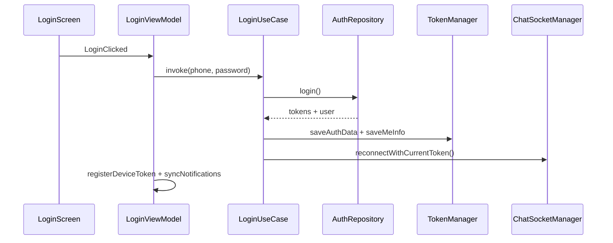

# Auth & Session — Học từ Source Code

## 1. Bài toán

- Đăng nhập phone/password, Google, Facebook
- Lưu session (access + refresh token)
- App mở lại → validate session, route đúng role
- Token hết hạn → refresh silent, reconnect socket chat

## 2. Kiến trúc



## 3. Walkthrough source (đọc theo thứ tự)

| # | File | Đọc gì |
|---|------|--------|
| 1 | `ui/screens/auth/login/LoginScreen.kt` | Form, social buttons, collect state |
| 2 | `ui/screens/auth/login/LoginViewModel.kt` | Events, validation, post-login side effects |
| 3 | `domain/usecase/LoginUseCase.kt` | Save token + reconnect socket |
| 4 | `domain/usecase/ValidateSessionUseCase.kt` | Cold start session + refresh chain |
| 5 | `data/local/datastore/TokenManager.kt` | Flow access token, user id, roles |
| 6 | `MainViewModel.kt` | Splash: onboarding → validate → destination |

### Social login

| Provider | UseCase | Helper |
|----------|---------|--------|
| Google | `LoginWithGoogleUseCase` | `ui/utils/GoogleLoginHelper.kt` |
| Facebook | `LoginWithFacebookUseCase` | Facebook SDK trong `RegisterScreen` / manifest |

## 4. Đoạn code đáng học

### 4.1. Login + side effects

Sau login thành công, **không chỉ** save token — còn:

```kotlin
// LoginViewModel — sau login success
registerDeviceTokenUseCase()
syncNotificationsUseCase()
```

→ FCM token và notification list sync ngay khi vào app.

### 4.2. Refresh token chain

`ValidateSessionUseCase.fetchMeWithRefresh()`:

1. `authRepository.getMe()`
2. Nếu `UnauthorizedException` → lấy refresh token → `authRepository.refreshToken()`
3. `tokenManager.updateTokens()` + `chatSocketManager.reconnectWithCurrentToken()`
4. Retry `getMe()`
5. Fail cuối → `tokenManager.clearAuthData()` + `chatSocketManager.disconnect()`

**Bài học:** Mọi side effect phụ thuộc auth (socket, push) phải hook vào refresh/logout.

### 4.3. Remember me

`TokenManager` lưu phone khi `rememberMe = true`. `LoginViewModel.loadSavedCredentials()` pre-fill form.

## 5. Post-login routing

`resolveStartDestination()` / `toStartDestination()` map role → graph:

| Role | Destination |
|------|-------------|
| `CUSTOMER` | `CustomerGraph` / Home |
| `BUSINESS` | `RestaurantGraph` / Dashboard |
| `ADMIN` | `AdminGraph` |

File: `ui/navigation/` (helper functions cạnh routes).

## 6. Auth flows khác

| Flow | Screen | ViewModel | UseCase |
|------|--------|-----------|---------|
| Register | `RegisterScreen` | `RegisterViewModel` | `RegisterUseCase`, `VerifyAccountUseCase` |
| Forgot password | `ForgotPasswordScreen` | — | `SendResetPasswordCodeUseCase` |
| Reset password | `ResetPasswordScreen` | — | `ResetPasswordUseCase` |
| Verify OTP | `VerificationScreen` | `VertificationViewModel` | `VerifyCodeUseCase` |
| Change password | `ChangePasswordScreen` | — | `ChangePasswordUseCase` |
| Logout | Profile | `ProfileViewModel` | `LogoutUseCase` |

## 7. Demo scenarios

```
Scenario: Cold start đã login
1. Kill app → mở lại
2. MainViewModel validate session
3. Vào đúng Home/Dashboard theo role

Scenario: Access token expired
1. API trả 401
2. ValidateSession refresh silent
3. User không thấy màn login (nếu refresh OK)

Scenario: Refresh token invalid
1. Clear auth → LoginRoute
2. Socket disconnect
```

## 8. Test / debug

- Log tag: filter `ValidateSession`, `LoginViewModel`
- Kiểm tra DataStore: access token có sau login không
- Social login cần `local.properties` keys (xem root README)

## 9. Nếu làm lại từ đầu

1. `TokenManager` (DataStore) — access, refresh, userId, roles
2. `AuthApi` + `AuthRepositoryImpl`
3. `LoginUseCase` — save + socket reconnect
4. `ValidateSessionUseCase` — refresh chain
5. `LoginViewModel` + `LoginScreen`
6. `MainViewModel` bootstrap
7. Route theo role

## 10. Hạn chế & TODO

- Chưa có centralized `AuthInterceptor` doc riêng — logic refresh chủ yếu ở `ValidateSessionUseCase`
- Logout cần đảm bảo clear Room cache (notification/chat) nếu multi-account

## 11. Tham chiếu

- [navigation.md](navigation.md)
- [notification.md](notification.md) — register FCM sau login
- [../decisions/004-token-refresh-chain.md](../decisions/004-token-refresh-chain.md)
