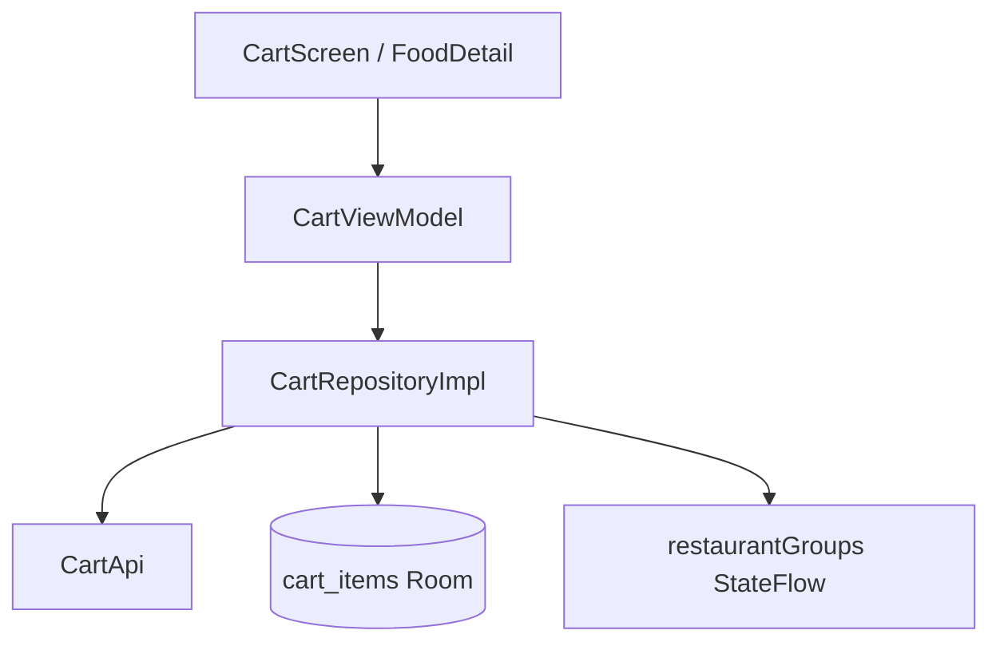

# Cart — Multi-Restaurant & Optimistic Add

## 1. Bài toán

- Giỏ hàng chứa món từ **nhiều nhà hàng** (kiểu Shopee)
- Checkout chỉ 1 NH mỗi lần — sau order chỉ xóa món NH đó
- UX thêm món phải nhanh — optimistic local trước khi API trả về

## 2. Kiến trúc



## 3. Walkthrough source

| File | Vai trò |
|------|---------|
| `ui/screens/customer/cart/CartScreen.kt` | UI nhóm theo restaurant |
| `ui/screens/customer/cart/CartViewModel.kt` | State, sync, checkout navigate |
| `data/repository/CartRepositoryImpl.kt` | Core logic |
| `data/local/room/dao/CartDao.kt` | CRUD local |
| `data/local/room/entity/CartEntity.kt` | Schema — PK (foodId, size, restaurantId) |
| `ui/components/cart/RestaurantCartBar.kt` | Bar checkout từng NH |
| `ui/components/cart/FlyToCartState.kt` | Animation thêm món |

## 4. Server-as-source-of-truth

Mọi mutation API thành công → `applyServerCart(cartResponse)`:

```kotlin
private suspend fun updateLocalCart(cartResponse: CartResponse) {
    val entities = cartResponse.items.map { it.toEntity() }
    cartDao.clearCart()
    entities.forEach { cartDao.insertCartItem(it) }
    _restaurantGroups.value = cartResponse.toRestaurantGroups()
}
```

**ADR:** [../decisions/005-server-as-cart-source-of-truth.md](../decisions/005-server-as-cart-source-of-truth.md)

## 5. Optimistic add + rollback

```kotlin
override suspend fun addToCartWithOptimisticLocal(...): Result<Unit> {
    val snapshot = captureOptimisticSnapshot(entity)
    cartDao.addToCartAtomic(entity)
    return addToCart(...)
        .onFailure { rollbackOptimisticAdd(snapshot) }
}
```

Snapshot lưu:
- `hadExistingItem`
- `quantityBefore`

→ Rollback đúng cả case đã có món cùng size trong giỏ.

**Cookbook:** [../cookbook/optimistic-ui-rollback.md](../cookbook/optimistic-ui-rollback.md)

## 6. Checkout integration

`CheckoutViewModel` filter cart theo `checkoutArgs.restaurantId`:

```kotlin
cartRepository.cartItems.first()
    .filter { it.restaurantId == checkoutArgs.restaurantId }
```

`createOrder` gửi `clearCartAfterOrder = false` — BE chỉ xóa món NH vừa order.

## 7. API business

Chi tiết BE: `docs/Cart.md`

## 8. Demo scenarios

```
Scenario: Multi-restaurant
1. Thêm món NH A + NH B
2. Cart hiện 2 nhóm
3. Checkout NH A → order success
4. Cart còn NH B

Scenario: Optimistic fail
1. Thêm món (local tăng ngay)
2. API fail (mạng)
3. Quantity rollback về trước
```

## 9. Nếu làm lại từ đầu

1. `CartEntity` + `CartDao` (composite PK)
2. `CartApi` — get, add, update, delete, clearByRestaurant
3. `CartRepositoryImpl` — `applyServerCart` + optimistic
4. `CartViewModel` observe `cartItems` Flow
5. UI group by `restaurantId`

## 10. Tham chiếu

- [checkout-payment.md](checkout-payment.md)
- [../learning/patterns.md](../learning/patterns.md)
