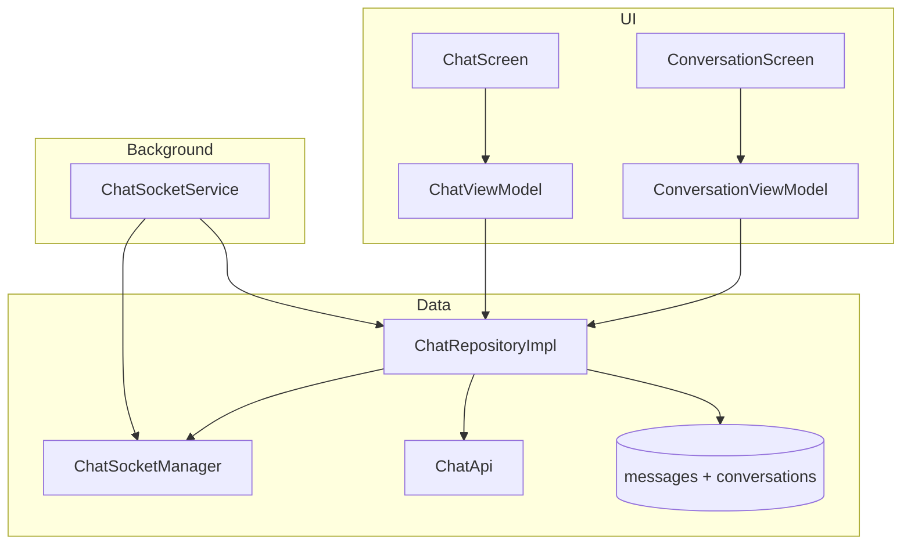

# Chat — Socket.IO, Optimistic Message & Polling Fallback

## 1. Bài toán

- Chat realtime giữa customer và seller (owner nhà hàng)
- 1 cặp customer+seller = 1 conversation (không gắn orderId)
- Gửi text + ảnh, hiển thị unread badge, load more lịch sử
- Mạng không ổn định — cần fallback

## 2. Kiến trúc tổng quan



## 3. Walkthrough source (đọc theo thứ tự)

| # | File | Đọc gì |
|---|------|--------|
| 1 | `ui/screens/chat/ConversationScreen.kt` | Danh sách hội thoại |
| 2 | `ui/screens/chat/ConservationViewModel.kt` | Sync list, search filter |
| 3 | `ui/screens/chat/ChatScreen.kt` | Màn chat chi tiết |
| 4 | `ui/screens/chat/ChatViewModel.kt` | Init, send, poll, load more |
| 5 | `data/repository/ChatRepositoryImpl.kt` | **Core logic** |
| 6 | `data/remote/socket/ChatSocketManager.kt` | Socket singleton |
| 7 | `services/ChatSocketService.kt` | Background listener |
| 8 | `util/ChatMessageTime.kt` | Timestamp, sort, display |

> **Lưu ý naming:** `ConservationViewModel` = Conversation list (typo trong codebase).

## 4. Luồng mở chat

### Từ conversation list

`ChatEvent.InitChat(conversationId)` →
1. `joinRoom` + `markAsRead`
2. `observeMessages` (Room Flow)
3. `startMessagePolling` (8s)
4. `syncConversationDetail(page=0)`

### Từ order

`ChatEvent.InitChatFromOrder(orderId, sellerId)` →
1. `syncConversationDetailByOrder`
2. Nếu fail và là customer → `createConversation(sellerId)`
3. Tiếp tục như trên

## 5. Gửi tin — Optimistic UI

```kotlin
// ChatRepositoryImpl.sendMessage
val tempId = UUID.randomUUID().toString()
messageDao.insertMessage(MessageEntity(id=tempId, isSending=true, ...))
socket.emit("text-chat", json)
scheduleSendTimeout(tempId)  // 15s → isFailed=true
```

Khi server broadcast về:

```kotlin
// handleNewMessage — dedup optimistic
if (senderIdsMatch(message.senderId, currentUserId)) {
    messageDao.deleteOptimisticDuplicates(...)
}
messageDao.insertMessage(normalizedMessage)
```

## 6. Socket manager

`ChatSocketManager`:
- `auth = mapOf("token" to bearerToken)`
- `reconnectWithCurrentToken()` — recreate socket sau login
- `awaitConnection(timeoutMs=10_000)` — suspend cho đến khi connected
- `onSocketReplaced` — re-attach listeners

Events: `join-room`, `leave-room`, `text-chat`, `exception`

## 7. Polling fallback

`ChatViewModel.startMessagePolling` — mỗi **8 giây** gọi `syncConversationDetail(conversationId, 0)`.

**ADR:** [../decisions/001-socket-plus-polling.md](../decisions/001-socket-plus-polling.md)

## 8. Gửi ảnh

1. Insert optimistic với `file://` local preview
2. `uploadImage` → REST multipart
3. Update message với remote URL
4. Emit socket `text-chat` với field `image`

## 9. Merge conversation preview

Khi sync list, nếu local `lastMessageTime` > server → giữ preview local (optimistic vừa gửi).

## 10. UI components

| Component | File |
|-----------|------|
| Chat bubble | `components/ChatBubble.kt` |
| Suggested replies | `components/SuggestReplies.kt` |
| Header | `components/ChatHeaderInfo.kt` |
| Skeleton | `components/ConversationSkeleton.kt` |

`messagesForMessengerDisplay()` — sort timeline + reverse cho UI messenger.

## 11. Unread badge

`UnreadChatViewModel` — `sumOf { it.unreadCount }` từ `getConversations()` Flow.

## 12. API contract (BE)

`docs/chat.md` — REST + Socket.IO đầy đủ.

## 13. Constants

| Constant | Value |
|----------|-------|
| Message poll interval | 8_000 ms |
| Send timeout | 15_000 ms |
| Page size (load more) | 20 messages |
| Socket connect timeout | 10_000 ms |

## 14. Demo scenarios

```
Scenario: Gửi tin mất mạng
1. Tin hiện "sending"
2. Sau 15s → isFailed
3. Bật mạng → poll sync lại

Scenario: Mở chat từ order chưa có conversation
1. Customer: createConversation(sellerId)
2. Business: chỉ sync by order — không create
```

## 15. Hạn chế & TODO

- `ChatState.isOnline = true` hardcode — chưa có presence API
- `ChatSocketService` và `ChatRepositoryImpl` cùng listen `text-chat` — cần cẩn thận duplicate (hiện cùng gọi `handleNewMessage` idempotent qua Room PK)
- FCM tap chưa mở thẳng conversation

## 16. Test

`ChatMessageTimeTest.kt` — parse ISO, sort comparator.

## 17. Nếu làm lại từ đầu

1. Room: `ConversationEntity`, `MessageEntity`, DAOs
2. `ChatApi` REST endpoints
3. `ChatSocketManager` singleton
4. `ChatRepositoryImpl` — send optimistic + socket listeners
5. `ChatViewModel` — observe Flow + poll
6. `ConversationViewModel` — list sync

## 18. Tham chiếu

- [notification.md](notification.md) — push type CHAT
- [order-tracking.md](order-tracking.md) — entry từ order
- [../cookbook/optimistic-ui-rollback.md](../cookbook/optimistic-ui-rollback.md)
