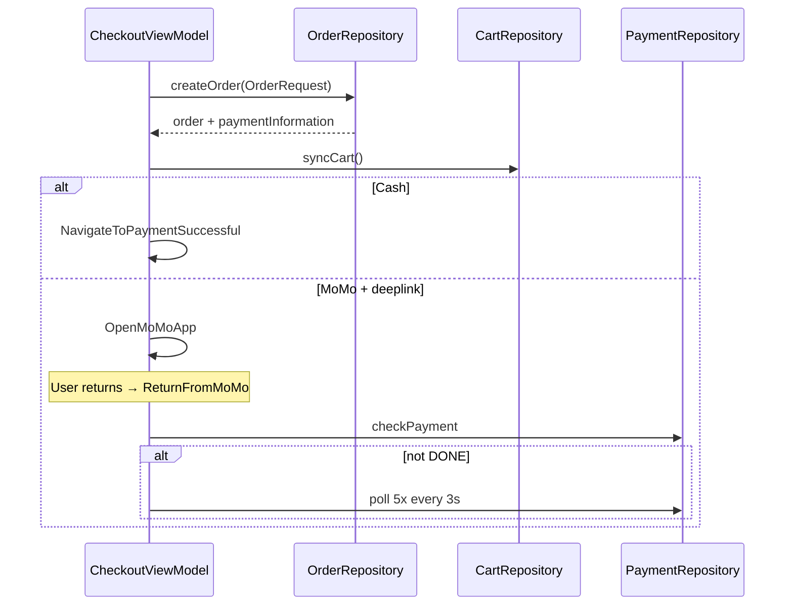

# Checkout & Payment — MoMo, Voucher, Delivery Fee

## 1. Bài toán

- Checkout 1 nhà hàng từ multi-restaurant cart
- Chọn địa chỉ, tính phí ship, áp voucher/promo code
- Thanh toán Cash hoặc MoMo (deeplink app)
- Poll xác nhận thanh toán MoMo sau khi user quay lại app

## 2. Walkthrough source

| File | Vai trò |
|------|---------|
| `ui/screens/customer/checkout/CheckoutScreen.kt` | UI |
| `ui/screens/customer/checkout/CheckoutViewModel.kt` | Logic chính |
| `data/repository/OrderRepositoryImpl.kt` | `createOrder` |
| `data/repository/PaymentRepositoryImpl.kt` | `checkPayment`, `getPaymentDetail` |
| `data/repository/VoucherRepositoryImpl.kt` | Suitable vouchers, promo code |
| `ui/screens/customer/checkout/CheckoutSuccessScreen.kt` | Success |

## 3. State & Effect

```kotlin
data class CheckoutState(
    val subtotal: Double,
    val discount: Double,
    val deliveryFee: Double?,
    val selectedVoucher: Voucher?,
    val paymentMethod: PaymentMethod,  // Cash | MoMo
    val isPolling: Boolean,
    ...
) {
    val total get() = (subtotal + (deliveryFee ?: 0.0) - discount).coerceAtLeast(0.0)
}

sealed interface CheckoutUiEffect {
    data class OpenMoMoApp(val deeplink: String, val total: Double)
    data class NavigateToPaymentSuccessful(val orderId: Int)
    ...
}
```

## 4. Luồng Place Order



## 5. Đoạn code đáng học

### 5.1. Voucher discount

```kotlin
private fun calculateDiscount(voucher: Voucher, subtotal: Double): Double {
    val raw = if (voucher.type == VoucherType.PERCENT)
        subtotal * (voucher.discountAmount / 100.0)
    else voucher.discountAmount
    return voucher.maxDiscountAmount?.let { raw.coerceAtMost(it) } ?: raw
}
```

### 5.2. Delivery fee

`loadDeliveryFee()` — cần `address.latitude/longitude` ≠ 0:

`orderRepository.getDeliveryFee(restaurantId, lat, lng)`

### 5.3. MoMo deeplink vs web

```kotlin
private fun isMoMoAppDeeplink(link: String): Boolean =
    !link.startsWith("http://") && !link.startsWith("https://")
```

Nếu không phải deeplink → fallback `confirmMoMoPayment()` ngay.

### 5.4. Poll payment

```kotlin
private suspend fun pollPaymentStatus(orderId: Int): Boolean {
    repeat(5) {
        delay(3000)
        if (paymentRepository.getPaymentDetail(orderId).getOrNull()?.paymentStatus == "DONE")
            return true
    }
    return false
}
```

## 6. Args từ navigation

`CheckoutRoute(restaurantId, restaurantName, discount, voucherId?)` — pre-select voucher từ màn NH.

## 7. API docs

- `docs/CheckoutFlow.md`
- `docs/payment-guide.md`

## 8. Demo scenarios

```
Scenario: MoMo success
1. Place order → mở MoMo app
2. Thanh toán xong → quay lại DFood
3. ReturnFromMoMo → poll → success screen

Scenario: Promo code min order
1. Nhập code có minOrderAmount > subtotal
2. promoError hiển thị
```

## 9. Nếu làm lại từ đầu

1. `CheckoutRoute` + `SavedStateHandle`
2. Observe cart filtered by restaurantId
3. Address sheet + delivery fee API
4. `OrderRequest` + `createOrder`
5. UiEffect MoMo + poll loop
6. Success screen với orderId

## 10. Tham chiếu

- [cart.md](cart.md)
- [order-tracking.md](order-tracking.md)
- [../cookbook/ui-effect-navigation.md](../cookbook/ui-effect-navigation.md)
