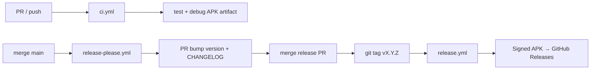

# CI/CD & Auto Release — Setup Portable cho Android

Tài liệu mô tả **pipeline GitHub Actions** của DFood và cách **copy sang project Android khác** để setup release APK tự động.

> Tóm tắt nhanh vẫn có trong [README.md](../../README.md) mục “Phát hành APK”. Doc này đi sâu walkthrough + playbook tái sử dụng.

---

## 1. Bài toán

- Mỗi PR cần chạy unit test + build debug APK
- Merge `main` → tự bump version + changelog
- Tag release → build **signed release APK** → upload GitHub Releases
- Không commit secrets (keystore, `google-services.json`)
- Team tải APK demo không qua Google Play

## 2. Tổng quan pipeline



| Workflow | File | Trigger | Output |
|----------|------|---------|--------|
| **CI** | `.github/workflows/ci.yml` | PR/push `main`, `develop` | Unit test + debug APK (artifact 7 ngày) |
| **Release Please** | `.github/workflows/release-please.yml` | Push `main` | PR bump `version.properties` + `CHANGELOG.md` |
| **Release** | `.github/workflows/release.yml` | Tag `v*` / manual dispatch | Signed `DFood-vX.Y.Z.apk` + ProGuard mapping |
| **CodeQL** | `.github/workflows/codeql.yml` | PR `main` + weekly | Security scan |

Phụ trợ: `.github/dependabot.yml` — cập nhật Gradle + GitHub Actions hàng tuần.

---

## 3. Walkthrough từng workflow

### 3.1. `ci.yml` — Validate mỗi PR

**Mục đích:** Chặn merge code break test hoặc không build được.

**Các bước chính:**

1. JDK 17 + Android SDK 35
2. Cache Gradle (`~/.gradle`)
3. **Prepare CI config** — không cần secrets thật:
   ```bash
   cp app/google-services.json.ci app/google-services.json
   echo "sdk.dir=..." >> local.properties
   echo "FACEBOOK_APP_ID=0" >> local.properties
   ```
4. `./gradlew testDebugUnitTest`
5. `./gradlew assembleDebug`
6. Upload `app-debug-{sha}.apk` (retention 7 ngày)
7. Nếu fail → upload test report

**File liên quan:**
- `app/google-services.json.ci` — placeholder Firebase (commit được)
- `local.properties` — **gitignored**, CI tạo tạm

### 3.2. `release-please.yml` — Tự động version PR

**Mục đích:** Không bump version tay — dựa vào Conventional Commits.

**Cấu hình:**
- `.github/release-please-config.json`
- `.github/.release-please-manifest.json` — version hiện tại (vd. `"1.0.0"`)

```json
// release-please-config.json (rút gọn)
{
  "packages": {
    ".": {
      "release-type": "simple",
      "changelog-path": "CHANGELOG.md",
      "skip-github-release": true,
      "extra-files": ["version.properties"]
    }
  }
}
```

`skip-github-release: true` — **release-please không tạo GitHub Release**. Việc đó do `release.yml` (vì cần build + sign APK).

**Commit message → bump:**
| Prefix | Bump |
|--------|------|
| `feat:` | minor |
| `fix:` | patch |
| `feat!:` / `BREAKING CHANGE` | major |

### 3.3. `release.yml` — Signed APK → Releases

**Mục đích:** Build production APK khi có tag `v1.2.3` hoặc chạy tay.

**Environment:** `production` — bắt buộc có secrets.

**Các bước chính:**

1. **Resolve version** từ tag `v1.2.3` → `1.2.3` hoặc input manual
2. `version_code = github.run_number` (luôn tăng — tránh conflict cài đè)
3. Decode `KEYSTORE_BASE64` → `release.keystore`
4. Ghi `google-services.json` từ secret
5. Ghi `local.properties` với Facebook/Google IDs
6. Build:
   ```bash
   ./gradlew assembleRelease \
     -PVERSION_NAME=1.2.3 \
     -PVERSION_CODE=$RUN_NUMBER
   ```
7. Rename → `DFood-v1.2.3.apk`
8. Generate release notes từ git log
9. `softprops/action-gh-release` — upload APK + `mapping.txt`
10. **Cleanup** — xóa keystore và secrets khỏi disk

### 3.4. `codeql.yml` — Security

Quét Java/Kotlin mỗi PR + schedule weekly. Không ảnh hưởng release.

---

## 4. Gradle — điều kiện bắt buộc

File: `app/build.gradle.kts`

### 4.1. Version đọc từ property hoặc file

```kotlin
val appVersionName = (project.findProperty("VERSION_NAME") as String?)
    ?: "$appVersionMajor.$appVersionMinor.$appVersionPatch"
val appVersionCode = (project.findProperty("VERSION_CODE") as String?)?.toIntOrNull()
    ?: versionProp("VERSION_CODE", "1").toInt()
```

- **Local:** `version.properties`
- **CI release:** `-PVERSION_NAME` + `-PVERSION_CODE` từ workflow

### 4.2. Signing — local và CI

```kotlin
signingConfigs {
    val keystorePath = System.getenv("KEYSTORE_PATH")?.let { rootProject.file(it) }
        ?: localProperties.getProperty("RELEASE_STORE_FILE")?.let { rootProject.file(it) }
    if (keystorePath != null && keystorePath.exists()) {
        create("release") {
            storeFile = keystorePath
            storePassword = System.getenv("KEYSTORE_PASSWORD")
                ?: localProperties.getProperty("RELEASE_STORE_PASSWORD")
            // KEY_ALIAS, KEY_PASSWORD tương tự
        }
    }
}
```

| Môi trường | Keystore |
|------------|----------|
| CI | `KEYSTORE_PATH=release.keystore` (env) |
| Local | `RELEASE_STORE_FILE` trong `local.properties` |

### 4.3. Release build type

- `isMinifyEnabled = true` + ProGuard
- Upload `mapping.txt` lên GitHub Release để deobfuscate crash sau này

---

## 5. GitHub Secrets — setup một lần

Tạo **Environment** tên `production` (Settings → Environments → protection rules tuỳ team).

| Secret | Mô tả | Cách tạo |
|--------|-------|----------|
| `KEYSTORE_BASE64` | File `.jks` encoded | Linux: `base64 -w0 release.jks` |
| `KEYSTORE_PASSWORD` | Mật khẩu keystore | Lúc tạo keystore |
| `KEY_ALIAS` | Alias key | Lúc tạo keystore |
| `KEY_PASSWORD` | Mật khẩu key | Lúc tạo keystore |
| `GOOGLE_SERVICES_JSON` | Nội dung file Firebase | Copy paste toàn bộ JSON |
| `FACEBOOK_APP_ID` | Facebook App ID | Meta Developer Console |
| `FACEBOOK_CLIENT_TOKEN` | Facebook Client Token | Meta Developer Console |
| `GOOGLE_WEB_CLIENT_ID` | Google OAuth Web Client ID | Google Cloud Console |

**CI workflow không dùng** các secrets trên — chỉ placeholder.

---

## 6. Quy trình hàng ngày (team)

### Release tự động (happy path)

1. Làm feature trên branch → commit `feat: add xyz` / `fix: abc`
2. Mở PR → đợi **CI** xanh
3. Merge vào `main`
4. Bot tạo PR **“chore: release X.Y.Z”** (release-please)
5. Review CHANGELOG + `version.properties` → merge PR
6. Git tag `vX.Y.Z` được tạo → **Release** workflow chạy
7. Tải `DFood-vX.Y.Z.apk` tại tab **Releases**

### Release khẩn cấp (manual)

**Cách 1:** GitHub → Actions → **Release** → Run workflow → nhập `1.0.3`

**Cách 2:**
```bash
git tag v1.0.3
git push origin v1.0.3
```

### Cài APK trên máy

1. Bật **Cài ứng dụng không rõ nguồn**
2. Tải APK từ Releases → cài đè bản cũ (cùng keystore + `versionCode` cao hơn)

---

## 7. Setup project Android mới — Playbook

Checklist đầy đủ: [../cookbook/android-cicd-template.md](../cookbook/android-cicd-template.md)

### Bước 1: Tạo release keystore (một lần)

```bash
keytool -genkey -v -keystore release.jks -keyalg RSA -keysize 2048 -validity 10000 -alias your_alias
```

**Backup** file `.jks` + mật khẩu — mất keystore = không update app đã phát hành.

### Bước 2: Gradle

Copy / adapt từ DFood:
- Đọc `version.properties`
- `signingConfigs` + `release { signingConfig = … }`
- `-PVERSION_NAME` / `-PVERSION_CODE` support

### Bước 3: Copy files GitHub

```
.github/
  workflows/
    ci.yml
    release.yml
    release-please.yml
    codeql.yml          # optional
  release-please-config.json
  .release-please-manifest.json
  dependabot.yml        # optional
version.properties
app/google-services.json.ci   # nếu dùng Firebase plugin
local.properties.example
CHANGELOG.md
```

**Sửa khi copy:**
| Chỗ | Đổi thành |
|-----|-----------|
| `DFood-v` trong `release.yml` | `YourApp-v` |
| `platforms;android-35` | Khớp `compileSdk` project |
| `package_name` trong `.ci` json | `applicationId` mới |
| `release-please-manifest` | `"1.0.0"` version khởi đầu |

### Bước 4: Firebase (nếu có)

1. Tạo project Firebase → thêm Android app
2. Tải `google-services.json` → secret `GOOGLE_SERVICES_JSON`
3. Tạo `google-services.json.ci` placeholder (copy DFood, đổi package)
4. Add **SHA-1 release** vào Firebase (lấy từ keystore):
   ```bash
   keytool -list -v -keystore release.jks -alias your_alias
   ```

### Bước 5: GitHub repo settings

1. Environment `production` + secrets (mục 5)
2. Actions enabled
3. (Tuỳ chọn) Branch protection `main` — require CI pass

### Bước 6: Verify

- [ ] Push PR → CI green + debug APK artifact
- [ ] Merge main → release-please PR xuất hiện
- [ ] Merge release PR → tag + Release workflow
- [ ] APK cài được trên thiết bị thật
- [ ] Google/Facebook login trên release build (nếu dùng)

---

## 8. Local build (không qua CI)

### Debug nhanh

```bash
./gradlew assembleDebug
# → app/build/outputs/apk/debug/app-debug.apk
```

### Signed release local

1. Copy `local.properties.example` → `local.properties`
2. Điền `RELEASE_STORE_FILE`, passwords, alias
3. ```bash
   ./gradlew assembleRelease
   # → app/build/outputs/apk/release/app-release.apk
   ```

---

## 9. So sánh Local vs CI

| | CI (`ci.yml`) | Release CI | Local dev |
|---|---------------|------------|-----------|
| `google-services.json` | `.ci` placeholder | Secret thật | File thật (gitignored) |
| Signing | Không | Keystore secret | `local.properties` |
| versionName | N/A | Git tag | `version.properties` |
| versionCode | N/A | `github.run_number` | `version.properties` |
| Output | debug APK | signed release APK | tuỳ task |

---

## 10. Troubleshooting CI/CD

| Triệu chứng | Nguyên nhân | Fix |
|-------------|-------------|-----|
| CI fail: missing `google-services.json` | Chưa có bước copy `.ci` | Kiểm tra step `Prepare CI config` |
| Release fail: keystore | Secret sai / base64 lỗi | Re-encode `KEYSTORE_BASE64`, check passwords |
| `Invalid version format` | Tag không đúng semver | Dùng `v1.0.0` (3 số) |
| APK cài không được | versionCode thấp hơn bản cũ | CI dùng `run_number` — OK; local phải tăng `VERSION_CODE` |
| Social login fail trên release | SHA-1 release chưa đăng ký | Add fingerprint vào Firebase/Facebook console |
| Release Please không tạo PR | Commit không conventional | Dùng `feat:`, `fix:` prefix |
| ProGuard crash khó đọc | Thiếu mapping | Tải `mapping.txt` từ GitHub Release cùng version |

Chi tiết thêm: [../troubleshooting.md](../troubleshooting.md) mục CI/CD.

---

## 11. Files map (DFood)

| File | Vai trò |
|------|---------|
| `.github/workflows/ci.yml` | Test + debug build |
| `.github/workflows/release.yml` | Signed release |
| `.github/workflows/release-please.yml` | Version PR bot |
| `.github/workflows/codeql.yml` | Security scan |
| `.github/release-please-config.json` | Release-please config |
| `.github/.release-please-manifest.json` | Current version |
| `.github/dependabot.yml` | Dependency updates |
| `version.properties` | Local version source |
| `app/build.gradle.kts` | Signing + version + BuildConfig |
| `app/google-services.json.ci` | CI Firebase placeholder |
| `local.properties.example` | Template secrets local |
| `CHANGELOG.md` | Auto-updated by release-please |

---

## 12. Bài học / best practices

1. **Tách CI và Release secrets** — PR build không cần keystore thật
2. **`skip-github-release` + workflow riêng** — release-please chỉ lo version/changelog; APK build tách biệt
3. **`versionCode` từ `run_number`** — tránh quên tăng versionCode khi release
4. **Upload ProGuard mapping** — đầu tư nhỏ, lợi lớn khi debug production crash
5. **Cleanup secrets sau release job** — `rm keystore` trong `if: always()`
6. **Conventional Commits** — team thống nhất prefix từ đầu project

---

## 13. Nếu làm lại từ đầu (project mới)

1. Keystore + backup
2. Gradle signing + version properties
3. Copy 4 workflows + release-please config
4. `google-services.json.ci` nếu Firebase
5. GitHub Environment `production` + 7 secrets
6. Test PR → test release-please → test full release
7. Document tên app / package trong cookbook template

---

## 14. Tham chiếu

- [README.md](../../README.md) — tóm tắt CI/CD
- [../cookbook/android-cicd-template.md](../cookbook/android-cicd-template.md) — checklist 1 trang
- [../case-study.md](../case-study.md) — portfolio mention
