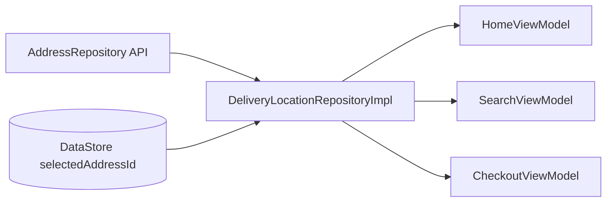

# Delivery Location — Shared State Địa Chỉ Giao

## 1. Bài toán

Địa chỉ giao hàng ảnh hưởng:
- Home (nhà hàng gần, label header)
- Search (kết quả theo lat/lng)
- Checkout (phí ship, địa chỉ order)
- All Restaurants

Cần **một nguồn sự thật** — đổi địa chỉ ở Home thì Search/Checkout cập nhật theo.

## 2. Giải pháp

`DeliveryLocationRepository` — `@Singleton` expose `StateFlow<DeliveryLocationState>`.



## 3. Walkthrough source

| File | Vai trò |
|------|---------|
| `domain/repository/DeliveryLocationRepository.kt` | Interface + `DeliveryLocationState` |
| `data/repository/DeliveryLocationRepositoryImpl.kt` | Implementation |
| `data/local/datastore/DataStoreManager.kt` | `saveSelectedAddressId` / `readSelectedAddressId` |
| `ui/screens/customer/home/HomeViewModel.kt` | Observe + `selectById` |
| `ui/screens/customer/search/SearchViewModel.kt` | Reload khi `selectedAddressId` đổi |
| `ui/screens/customer/checkout/CheckoutViewModel.kt` | `refreshAddresses`, sync selection |

## 4. Đoạn code đáng học

### resolveSelectedAddressId

Ưu tiên: persisted id → current in-memory → first address trong list.

```kotlin
// DeliveryLocationRepositoryImpl
private fun resolveSelectedAddressId(addresses, persistedId): Int? {
    if (persistedId != null && addresses.any { it.id == persistedId }) return persistedId
    // fallback current → first
}
```

### Search reload on address change

```kotlin
deliveryLocationRepository.deliveryLocation
    .map { it.selectedAddressId }
    .distinctUntilChanged()
    .drop(1)  // bỏ emit đầu
    .collectLatest {
        if (searchQuery.isBlank()) loadInitialData() else performSearch()
    }
```

**Bài học:** `drop(1)` tránh double-fetch lúc init.

## 5. Impact map

| Sửa DeliveryLocation | Ảnh hưởng |
|---------------------|-----------|
| `refreshAddresses()` | Home, Search, Checkout label |
| `selectById()` | Tất cả màn observe `deliveryLocation` |
| Không ảnh hưởng | Chat, Notification, Auth |

## 6. Nếu làm lại từ đầu

1. Interface `DeliveryLocationRepository` + `DeliveryLocationState`
2. Impl: combine `AddressRepository.getAddresses()` + DataStore selected id
3. Mỗi ViewModel cần location: `collectLatest { deliveryLocation }`
4. Khi user chọn địa chỉ: `selectById()` — không chỉ update local VM state

## 7. Tham chiếu

- [home.md](home.md)
- [search.md](search.md)
- [checkout-payment.md](checkout-payment.md)
- [address.md](address.md)
