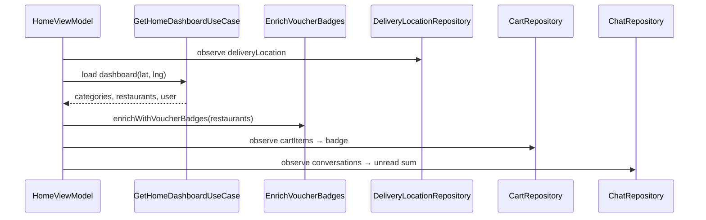

# Home Dashboard — Học từ Source Code

## 1. Bài toán

Màn Home customer hiển thị:
- Lời chào + profile
- Categories, restaurants (có khoảng cách nếu có GPS)
- Badge giỏ hàng, tin nhắn chưa đọc
- Địa chỉ giao đang chọn
- Voucher badge trên nhà hàng

## 2. Walkthrough source

| # | File |
|---|------|
| 1 | `ui/screens/customer/home/HomeScreen.kt` |
| 2 | `ui/screens/customer/home/HomeViewModel.kt` |
| 3 | `domain/usecase/GetHomeDashboardUseCase.kt` |
| 4 | `domain/usecase/EnrichRestaurantsWithVoucherBadgesUseCase.kt` |
| 5 | `data/repository/HomeRepositoryImpl.kt` |

## 3. Data flow



## 4. Đoạn code đáng học

### 4.1. Parallel voucher enrichment

`EnrichRestaurantsWithVoucherBadgesUseCase`:
- `Semaphore(5)` — tối đa 5 request đồng thời
- `cache[restaurantId]` — không gọi lại API cho cùng NH trong session
- Feature flag: `VoucherFeatureFlags.RESTAURANT_PUBLIC_VOUCHERS_ENABLED`

### 4.2. Multiple observers trong init

`HomeViewModel` observe đồng thời:
- `deliveryLocationRepository.deliveryLocation`
- `cartRepository.cartItems`
- `chatRepository.getConversations()`

→ Home là **aggregation screen** — pattern phổ biến cho dashboard.

### 4.3. UiEffect navigation

`HomeUiEffect` tách navigation (Cart, Conversations, Category, Restaurant…) khỏi `HomeState`.

## 5. UI components

| Component | File |
|-----------|------|
| Skeleton loading | `components/HomeSkeleton.kt` |
| Category row | `components/CategoryItem.kt` |
| Top bar + location | `components/HomeTopBar.kt` |
| Section header | `components/SectionHeader.kt` |

## 6. API liên quan

Xem `docs/Home.md` — `GET /user/profile`, `/categories`, `/restaurants` với `lat`/`lng`.

## 7. Demo scenarios

```
1. Đổi địa chỉ trên Home → list NH refresh theo khoảng cách
2. Thêm món → badge cart tăng (observe Room cart)
3. Có tin nhắn mới → badge message (sum unreadCount conversations)
```

## 8. Nếu làm lại từ đầu

1. `GetHomeDashboardUseCase` gọi API aggregate hoặc parallel calls
2. `HomeViewModel` + observe shared repos
3. Optional: enrich step sau khi có list restaurants
4. `HomeScreen` + pull-to-refresh → `HomeEvent.Refresh`

## 9. Tham chiếu

- [delivery-location.md](delivery-location.md)
- [search.md](search.md) — logic location tương tự
- [../learning/patterns.md](../learning/patterns.md) — parallel semaphore
