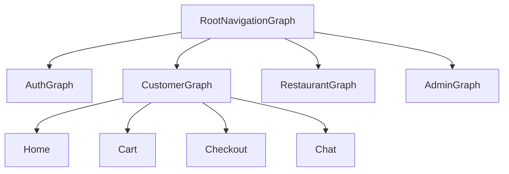

# Navigation — Multi-Role Graphs

## 1. Bài toán

Một APK phục vụ 3 persona với bottom bar và deep link khác nhau:
- **Customer:** Home, Orders, Notification, Profile
- **Restaurant:** Dashboard, Orders, Messages, Profile
- **Admin:** Dashboard, Restaurants, Orders, Settings

## 2. Giải pháp

**Navigation Compose** + **type-safe routes** (`kotlinx.serialization`).



## 3. Walkthrough source

| File | Nội dung |
|------|----------|
| `ui/navigation/Routes.kt` | Tất cả `@Serializable` route objects |
| `ui/navigation/NavGraph.kt` | `RootNavigationGraph`, nested graphs, composable destinations |
| `ui/navigation/AuthNavigation.kt` | Auth subgraph |
| `MainActivity.kt` | `NavHost`, `startDestination` từ `MainViewModel` |

### Routes quan trọng (Customer)

```kotlin
@Serializable object HomeRoute
@Serializable object CartRoute
@Serializable data class CheckoutRoute(val restaurantId: String, val restaurantName: String, ...)
@Serializable data class TrackOrderRoute(val orderId: String)
@Serializable data class ChatRoute(val conversationId: String?, val orderId: Int?, ...)
@Serializable object NotificationRoute
```

## 4. Bottom bar + badge

`NavGraph.kt`:

- `customerBottomBarRoutes` — hiện bottom bar khi đang ở Home/Orders/Notification/Profile
- `UnreadNotificationViewModel` scope graph-level — `hiltViewModel()` trong `RootNavigationGraph`
- `ON_RESUME` → `unreadNotificationViewModel.refresh()`
- Badge count truyền vào `DFoodBottomBar`

Tương tự restaurant có `UnreadChatViewModel` cho tin nhắn.

## 5. Notification deep link (in-app)

`NotificationScreen` nhận `onNavigate: (NotificationDestination) -> Unit`:

```kotlin
// domain/model/Notification.kt
fun Notification.resolveDestination(): NotificationDestination?
// ORDER → TrackOrderRoute
// CHAT → ChatRoute
// SYSTEM + RESTAURANT → admin approval
```

NavGraph wire `onNavigate` → `navController.navigate(...)`.

**Chưa có:** Deep link từ system notification tap (FCM → MainActivity không parse payload).

## 6. Back stack & args

- Checkout nhận args qua `SavedStateHandle.toRoute<CheckoutRoute>()`
- Chat có thể mở bằng `conversationId` hoặc `orderId + sellerId`

## 7. Pattern học được

| Pattern | Ứng dụng |
|---------|----------|
| Type-safe routes | Tránh typo route string |
| Nested navigation | Tách auth vs app graphs |
| Graph-scoped ViewModel | Badge shared nhiều tab |
| `LifecycleEventEffect(ON_RESUME)` | Refresh badge khi quay lại app |

## 8. Nếu làm lại từ đầu

1. Define `@Serializable` routes trong 1 file
2. `NavHost` với `startDestination = OnboardingRoute` hoặc role graph
3. `composable<HomeRoute> { HomeScreen(...) }`
4. Bottom bar bọc `Scaffold` ở graph level — check `currentDestination.hasRoute()`
5. Wire notification/chat navigate callbacks

## 9. Tham chiếu

- [auth-session.md](auth-session.md) — start destination theo role
- [notification.md](notification.md) — `resolveDestination()`
