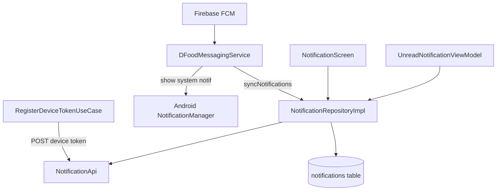

# Notification — FCM, Room Cache & In-App Navigation

## 1. Bài toán

- Push notification khi có đơn mới, chat, promotion…
- In-app list notification có pagination, mark read, delete
- Badge unread trên bottom bar
- Offline: vẫn đọc được notification đã cache

## 2. Kiến trúc



## 3. Walkthrough source

| File | Vai trò |
|------|---------|
| `service/DFoodMessagingService.kt` | FCM `onMessageReceived`, `onNewToken` |
| `domain/usecase/RegisterDeviceTokenUseCase.kt` | Lấy FCM token + register BE |
| `domain/usecase/SyncNotificationsUseCase.kt` | Sync wrapper |
| `data/repository/NotificationRepositoryImpl.kt` | CRUD + paging + offline fallback |
| `data/local/room/entity/NotificationEntity.kt` | Room schema |
| `domain/model/Notification.kt` | Domain + `resolveDestination()` |
| `ui/screens/notification/NotificationScreen.kt` | UI list |
| `ui/screens/notification/NotificationViewModel.kt` | Pagination state |
| `ui/screens/notification/UnreadNotificationViewModel.kt` | Badge Flow |

## 4. FCM flow

### onNewToken

```kotlin
registerDeviceTokenUseCase.registerToken(token)
```

Chỉ register khi: đã login + user bật notification trong settings (`DataStoreManager.readNotificationsState()`).

### onMessageReceived

1. Check notifications enabled
2. Parse `message.notification` hoặc `message.data["title"/"body"]`
3. `sendNotification()` — system notification channel `dfood_notifications`
4. Nếu logged in → `notificationRepository.syncNotifications()` (limit 50)

## 5. Register token — khi nào?

| Trigger | File |
|---------|------|
| App cold start (session OK) | `MainViewModel` |
| Login success | `LoginViewModel` |
| Bật notification trong settings | `ProfileViewModel` |
| FCM token refresh | `DFoodMessagingService.onNewToken` |

## 6. In-app list

`NotificationViewModel`:
- Page size: **10**
- `LoadMore` khi scroll gần cuối (`lastVisibleIndex >= total - 2`)
- `ON_RESUME` → reload + refresh unread count

### Offline-first paging

```kotlin
// NotificationRepositoryImpl.getNotificationsPaged
try {
    api.getNotifications(...) → insert Room → success
} catch {
    dao.getNotifications(pageSize, offset) → fallback local
}
```

**ADR:** [../decisions/002-room-cache-strategy.md](../decisions/002-room-cache-strategy.md)

## 7. Deep link trong app

```kotlin
fun Notification.resolveDestination(): NotificationDestination? {
    when {
        type == CHAT -> Chat(conversationId)
        type == ORDER || PAYMENT -> Order(orderId)
        type == SYSTEM && targetType == RESTAURANT -> RestaurantApproval
    }
}
```

`NotificationScreen` → `onNavigate(destination)` → `NavGraph` wire routes.

## 8. Notification types

```kotlin
enum class NotificationType {
    ORDER, PROMOTION, SYSTEM, PAYMENT, CHAT
}
```

Actions (comma-separated in Room): `ACCEPT_ORDER`, `CONFIRM_RECEIVED` — xem `docs/OrderFlow.md` section Notifications.

## 9. Mark read / delete

Optimistic local: API fail vẫn update Room (`markAsRead`, `deleteNotification`).

## 10. Badge

`UnreadNotificationViewModel`:
```kotlin
notificationRepository.getUnreadCountFlow()  // Room Flow
// + refresh() sync từ server on resume
```

## 11. API

`docs/Apidocs.md` section 15 — `/notification/me`, `/unread-count`, etc.

## 12. Demo scenarios

```
Scenario: Push khi app background
1. FCM delivers data
2. System notification hiện
3. Room sync 50 items mới nhất

Scenario: Mở notification list offline
1. API fail
2. Vẫn hiện data từ Room cache

Scenario: Tap notification trong app
1. resolveDestination → navigate TrackOrder / Chat
```

## 13. Hạn chế & TODO

- System notification tap → chỉ mở `MainActivity`, **chưa** parse payload để deep link
- Channel importance `IMPORTANCE_DEFAULT` — có thể nâng lên HIGH cho order urgent

## 14. Nếu làm lại từ đầu

1. Firebase setup + `google-services.json`
2. `DFoodMessagingService` + manifest
3. `DeviceApi` register token
4. `NotificationEntity` + DAO + Repository
5. `NotificationViewModel` pagination
6. `resolveDestination()` + NavGraph wire
7. `UnreadNotificationViewModel` ở graph level

## 15. Tham chiếu

- [auth-session.md](auth-session.md) — register token sau login
- [navigation.md](navigation.md) — badge bottom bar
- [chat.md](chat.md) — CHAT type notification
